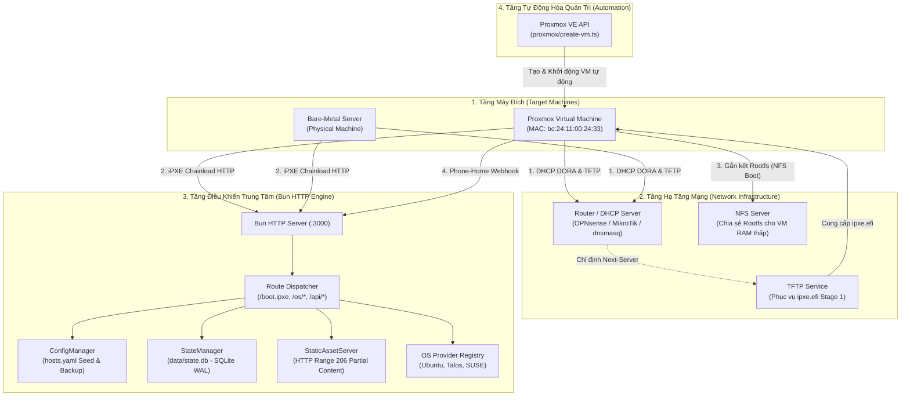
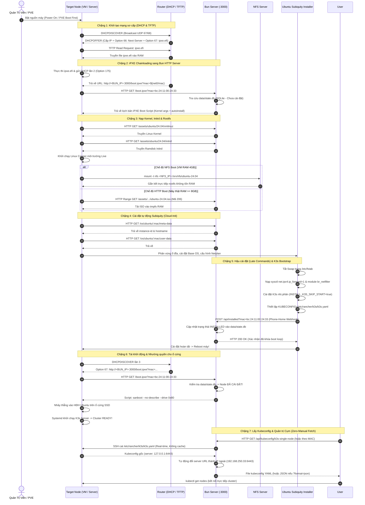

# Hướng Dẫn Vận Hành & Kiến Trúc Toàn Trình (How It Works)

Chào mừng bạn đến với tài liệu kiến trúc toàn trình của hệ thống **Bun Multi-OS iPXE & Cloud-Init Server**.

Tài liệu này giải thích chi tiết bức tranh tổng thể về cách thức một máy tính trắng (Bare-Metal hoặc máy ảo Proxmox VE) chuyển mình thành một máy chủ Kubernetes (**K3s**) hoàn chỉnh chỉ từ một lệnh bật nguồn (**Zero-Touch Provisioning - ZTP**).

---

## 1. Sơ Đồ Kiến Trúc Hệ Thống (System Architecture)

---

## 2. Luồng Vận Hành Toàn Trình (End-to-End Sequence Diagram)

Dưới đây là chu kỳ tương tác thời gian thực từ lúc máy tính được cấp nguồn cho đến khi cụm Kubernetes đi vào hoạt động ổn định:

---

## 3. Các Chặng Chuyển Đổi Vòng Đời (Lifecycle Boot Phases)

Hệ thống hoạt động mượt mà nhờ việc phân định ranh giới rõ ràng giữa 7 giai đoạn kế tiếp nhau:

| Giai Đoạn | Thực Thể Chịu Trách Nhiệm | Nhiệm Vụ Cốt Lõi | Cơ Chế Bàn Giao (Handoff) |
| :--- | :--- | :--- | :--- |
| **Phase 1: Hardware POST** | Bo mạch chủ / Card mạng | Khởi tạo phần cứng, kích hoạt PXE ROM. | Phát sóng gói tin DHCPDISCOVER. |
| **Phase 2: Stage 1 iPXE** | TFTP Server | Nạp `ipxe.efi` (vài trăm KB) vào bộ nhớ RAM. | Thực thi nhị phân iPXE trong không gian EFI. |
| **Phase 3: Stage 2 HTTP** | Bun HTTP Server | Truy vấn MAC trong `data/state.db` (SQLite) để trả về iPXE script tương ứng. | Lệnh iPXE `kernel` và `initrd` nạp Linux. |
| **Phase 4: Live OS Boot** | Linux Casper Environment | Mount hệ thống tệp gốc qua **NFS** hoặc nạp **ISO vào RAM**. | Khởi chạy tiến trình `subiquity` của Canonical. |
| **Phase 5: Subiquity Engine** | Cloud-Init & Curtin | Đọc cấu hình từ `/os/ubuntu/:mac/user-data`, phân vùng ổ đĩa, chạy late-commands. | Gửi Webhook Phone-Home `/api/installed` rồi `reboot`. |
| **Phase 6: Production Run** | Local Drive / K3s / RKE2 | iPXE nhận diện trạng thái đã cài -> thực thi `sanboot 0x80`. | Máy khởi động vào OS trên SSD và cụm Kubernetes sẵn sàng. |
| **Phase 7: Cluster Access** | Bun Kubeconfig API | Cung cấp endpoint `GET /api/kubeconfig/:identifier` SSH thời gian thực, tự đổi server IP. | Trả file YAML/JSON sẵn sàng cho `kubectl` kết nối từ xa. |

---

## 4. Mô Hình Cấu Hình Khai Báo (Declarative Infrastructure)

Hệ thống tuân thủ triệt để nguyên lý **Infrastructure as Code (IaC)**. Quản trị viên không cần gõ lệnh thủ công trên từng node, tất cả định nghĩa nằm trong [config/hosts.yaml](file:///Users/timi/lab/lab-ipxe-os/config/hosts.yaml):

1. **Khối cấu hình mặc định (`default`)**: Áp dụng cho mọi máy lạ chưa đăng ký địa chỉ MAC (Zero-Touch cắm là chạy).
2. **Khối cấu hình máy chủ (`hosts`)**: Ghi đè chi tiết theo từng địa chỉ MAC cụ thể:
   - Hostname, địa chỉ IP tĩnh / Netmask / Gateway / DNS.
   - Hệ điều hành mục tiêu (`ubuntu`, `talos`, `suse-micro`).
   - Profile chuyên biệt (`k3s-single-node`, `generic`).
   - Phương thức nạp rootfs (`boot_method: nfs` cho VM hoặc `boot_method: http` cho máy thật).
   - Thiết bị lưu trữ mục tiêu (`target_disk: /dev/sda` hoặc `/dev/nvme0n1`).

---

## 5. Danh Mục Tài Liệu Chuyên Sâu (Master Navigation Hub)

Để tìm hiểu sâu hơn về từng khía cạnh kỹ thuật cụ thể, vui lòng tham khảo các chuyên đề bên dưới:

- 🌐 [**Giao Thức Mạng & Thiết Lập Bộ Định Tuyến** (`network-protocols.md`)](network-protocols.md):
  * Phân tích chi tiết chu kỳ DHCP DORA và các DHCP Option 66, 67, 60, 93, 175.
  * Bản chất kỹ thuật của Two-Stage Chainloading.
  * Cấu hình mẫu sẵn sàng copy-paste cho OPNsense/pfSense, MikroTik, dnsmasq, và OpenWrt.
- ⚙️ [**Động Cơ Cài Đặt Hệ Điều Hành** (`os-engines.md`)](os-engines.md):
  * Phân tích Casper, Subiquity Autoinstall và Cloud-Init.
  * So sánh chi tiết kỹ thuật Rootfs: HTTP Range 206 Partial Content vs. NFS Stream Boot.
  * Mổ xẻ Profile `k3s-single-node` (Ubuntu) và `rke2-single-node` (openSUSE Leap Micro).
  * Giới thiệu Talos Linux MachineConfig và openSUSE Combustion.
  * Mô hình kiến trúc 2 tầng Registry: Provider Registry & Profile Registry Map.
  * Hướng dẫn từng bước tự thêm Profile và OS Provider mới.

- 🛡️ [**Cơ Chế Chống Boot Loop & Máy Trạng Thái** (`anti-boot-loop.md`)](anti-boot-loop.md):
  * Giải quyết nghịch lý vòng lặp cài đặt vô tận trong Zero-Touch Provisioning.
  * Kỹ thuật chuyển giao phần cứng `sanboot --drive 0x80 || exit 1`.
  * Kiến trúc State Machine `data/state.db` (SQLite WAL) và giao thức Phone-Home Webhook.
  * Các kịch bản phục hồi ngoại lệ và quy trình ép cài đặt lại (`force_install`).
- 🩺 [**Sổ Tay Chẩn Đoán & Xử Lý Sự Cố** (`troubleshooting.md`)](troubleshooting.md):
  * Sơ đồ phân tầng tìm lỗi từ L1/L2 Mạng đến Subiquity và Kubernetes.
  * Xử lý triệt để lỗi OOM Killer crash installer trên VM RAM 4GB–5GB.
  * Cách bật Emergency Shell và xem log thời gian thực trong quá trình cài đặt.
  * Bảng tra cứu nhanh triệu chứng và mã lệnh cứu hộ khẩn cấp.
