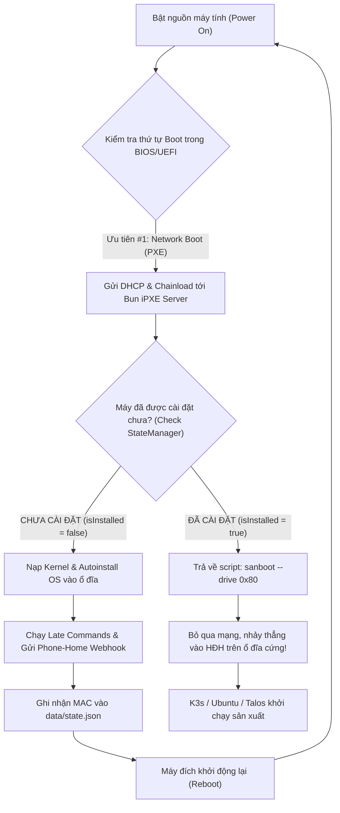

# Cơ Chế Chống Boot Loop & Máy Trạng Thái (Anti-Boot-Loop & State Machine)

Tài liệu này giải thích chi tiết nghịch lý cốt lõi trong mô hình **Zero-Touch Provisioning (ZTP)**, nguyên lý hoạt động của máy trạng thái (**State Machine**) trong dự án, kỹ thuật nhường quyền điều khiển phần cứng (**Hardware Handoff** qua `sanboot`), và cơ chế khóa vòng lặp cài đặt vĩnh viễn thông qua **Phone-Home Webhook**.

---

## 1. Nghịch Lý Boot Loop Trong Cài Đặt Tự Động (The ZTP Boot Dilemma)

Để đạt được mục tiêu **Zero-Touch Provisioning (ZTP)** (cắm điện máy mới là tự động cài đặt hoàn chỉnh từ A đến Z mà không cần con người can thiệp vào bàn phím hay màn hình):
1. **Bắt buộc**: Máy chủ (Bare-metal) hoặc máy ảo (VM) phải được cấu hình thứ tự khởi động trong BIOS/UEFI là **Network Boot (PXE) ưu tiên số 1**.
2. **Hệ quả nghịch lý**: Sau khi hệ điều hành (Ubuntu, Talos...) cài đặt thành công 100% vào ổ cứng và thực hiện lệnh khởi động lại (`reboot`), bo mạch chủ lại tiếp tục ưu tiên boot qua card mạng!
3. **Thảm họa**: Nếu máy chủ iPXE không có bộ nhớ nhận diện trạng thái, nó sẽ tiếp tục gửi kịch bản cài đặt OS. Máy tính sẽ bị format lại ổ đĩa và lọt vào **vòng lặp cài đặt vô tận (Infinite Reinstall Loop)**!



---

## 2. Kỹ Thuật Nhường Quyền Điều Khiển Phần Cứng (Hardware Handoff)

Khi Bun server xác định node đã hoàn tất cài đặt, nó không trả về menu cài đặt mà trả về kịch bản iPXE đặc biệt sau (định nghĩa tại [src/routes/ipxe.ts](file:///Users/timi/lab/lab-ipxe-os/src/routes/ipxe.ts)):

```ipxe
#!ipxe
echo ==========================================================
echo Node [k3s-single-node] (bc:24:11:00:24:33) is ALREADY INSTALLED.
echo Bypassing network installation. Booting local disk...
echo (To reinstall, trigger API: POST http://192.168.250.202:3000/api/reset?mac=bc:24:11:00:24:33)
echo ==========================================================
sleep 2
sanboot --no-describe --drive 0x80 || exit 1
```

### 2.1. Lệnh `sanboot --no-describe --drive 0x80` hoạt động như thế nào?
- `0x80` (Hệ thập lục phân) đại diện cho **ổ cứng vật lý thứ nhất (First Hard Drive)** trong kiến trúc BIOS chuẩn ngắt `INT 13h`.
- Trong môi trường UEFI hiện đại, iPXE ánh xạ `0x80` tới thiết bị lưu trữ cục bộ đầu tiên theo giao thức **UEFI Block I/O Protocol**.
- Cờ `--no-describe` chỉ thị cho iPXE không tạo thêm các bảng mô tả thiết bị SAN ảo phức tạp trong bộ nhớ ACPI, giúp quá trình chuyển giao quyền điều khiển CPU sang Master Boot Record (MBR) hoặc EFI System Partition (ESP) trên ổ cứng diễn ra ngay lập tức mà không làm gián đoạn kernel boot.

### 2.2. Cơ chế cứu hộ dự phòng `|| exit 1`
Nếu lệnh `sanboot` gặp sự cố (ví dụ: ổ cứng thứ nhất chưa có bootloader hợp lệ hoặc firmware UEFI của hãng không hỗ trợ ngắt chuyển tiếp iPXE):
- Lệnh `exit 1` sẽ kết thúc chương trình thực thi của iPXE EFI Application (`ipxe.efi`).
- Ngay khi iPXE thoát với mã lỗi khác 0, trình quản lý **UEFI Boot Manager (NVRAM)** của bo mạch chủ sẽ tự động chuyển tiếp sang mục ưu tiên khởi động kế tiếp trong danh sách (thông thường là mục `ubuntu` trỏ vào `\EFI\ubuntu\shimx64.efi` trên ổ đĩa nội bộ).

---

## 3. Kiến Trúc State Machine Của Bun Server

Toàn bộ logic quản lý trạng thái cài đặt được tập trung trong lớp `StateManager` tại [src/core/state.ts](file:///Users/timi/lab/lab-ipxe-os/src/core/state.ts).

### 3.1. Cấu Trúc Dữ Liệu `data/state.json`
Trạng thái được lưu trữ bền vững (persistent) dưới dạng JSON trên ổ đĩa máy chủ:

```json
{
  "installed": {
    "bc:24:11:00:24:33": {
      "mac": "bc:24:11:00:24:33",
      "hostname": "k3s-single-node",
      "os": "ubuntu",
      "client_ip": "192.168.250.33",
      "installed_at": "2026-09-14T07:25:39.124Z"
    }
  }
}
```

### 3.2. Chu Kỳ Chuyển Đổi Trạng Thái (State Transitions)

```
[ UNCONFIGURED / NEW_NODE ]
            │
            ▼ (Được khai báo trong hosts.yaml hoặc dùng cấu hình mặc định default)
      [ REGISTERED ]
            │
            ▼ (Client kéo boot.ipxe & bắt đầu tải Kernel/Initrd)
     [ PROVISIONING ]
            │
            ▼ (Subiquity hoàn thành cài đặt -> Gửi Webhook Phone-Home)
       [ INSTALLED ]  ◄── (Khóa chặn Boot Loop vĩnh viễn)
            │
            ├── (Mỗi lần Reboot sau đó: Thực thi sanboot boot ổ cứng)
            │
            ▼ (Quản trị viên muốn cài lại: Gọi API Reset hoặc cờ force_install)
  [ REINSTALL_REQUESTED ] ──> Quay lại trạng thái PROVISIONING
```

---

## 4. Cơ Chế Phone-Home Webhook

Quá trình "xác nhận hoàn tất" diễn ra tự động 100% từ chính bên trong máy tính vừa được cài đặt.

Tại thời điểm Subiquity hoàn thành việc ghi dữ liệu vào ổ cứng, nó kích hoạt danh sách lệnh `late-commands` bên trong chroot của máy đích (định nghĩa tại [src/providers/ubuntu/profiles/index.ts](file:///Users/timi/lab/lab-ipxe-os/src/providers/ubuntu/profiles/index.ts)):

```bash
curtin in-target --target=/target -- curl -s -X POST \
  "http://192.168.250.202:3000/api/installed?mac=bc%3A24%3A11%3A00%3A24%3A33&hostname=k3s-single-node&os=ubuntu"
```

Khi máy chủ Bun nhận được request tại route `/api/installed` ([src/routes/api.ts](file:///Users/timi/lab/lab-ipxe-os/src/routes/api.ts)):
1. Chuẩn hóa địa chỉ MAC (chuyển chữ thường, thay `-` bằng `:`, bỏ prefix `0x`).
2. Ghi nhận record vào `data/state.json`.
3. Trả về mã phản hồi HTTP `200 OK`.
4. Kể từ thời khắc này, mọi truy vấn iPXE từ địa chỉ MAC này sẽ chỉ nhận được lệnh `sanboot 0x80`.

---

## 5. Quy Trình Cài Đặt Lại Máy (Re-installation Workflow)

Khi bạn muốn cài đặt lại hệ điều hành cho một máy đã được đánh dấu `INSTALLED`, bạn có 3 cách linh hoạt:

### Cách 1: Gọi API Quản Trị Reset (Tiện lợi nhất)
Gửi lệnh HTTP POST tới endpoint `/api/reset`:
```bash
curl -X POST "http://192.168.250.202:3000/api/reset?mac=bc:24:11:00:24:33"
```
Kết quả: Máy chủ xóa MAC khỏi `data/state.json`. Lần khởi động tiếp theo, máy sẽ lại hiện menu cài đặt.

### Cách 2: Khai báo cờ `force_install` trong `config/hosts.yaml`
```yaml
hosts:
  "bc:24:11:00:24:33":
    hostname: "k3s-single-node"
    os: ubuntu
    force_install: true   # <--- Đặt thành true để ép buộc cài đặt lại
```

### Cách 3: Nạp URL Boot kèm tham số `?force=true`
Trong iPXE CLI hoặc trên Router:
```ipxe
chain --autofree http://192.168.250.202:3000/boot.ipxe?mac=${net0/mac}&force=true
```

---

## 6. Xử Lý Các Kịch Bản Ngoại Lệ (Edge Cases)

| Tình Huống Ngoại Lệ | Hành Vi Của Hệ Thống | Giải Pháp Xử Lý |
| :--- | :--- | :--- |
| **Mất điện hoặc lỗi mạng giữa chừng khi đang cài đặt** | Vì lỗi xảy ra TRƯỚC bước `late-commands`, webhook chưa được kích hoạt -> Node chưa bị đánh dấu `INSTALLED`. Khi có điện lại, máy sẽ tự động khởi động lại quá trình cài đặt từ đầu một cách an toàn. | Hệ thống tự phục hồi tự động, không cần thao tác thủ công. |
| **Webhook thất bại do Router bị nghẽn gói** | Cờ `|| true` trong late-command đảm bảo quá trình cài đặt của Subiquity không bị dừng đột ngột. Tuy nhiên lần boot sau máy sẽ bị cài lại. | Kiểm tra firewall/ACL giữa subnet máy đích và cổng 3000 của Bun Server. |
| **Máy chủ Bun bị restart hoặc sập nguồn** | Dữ liệu `data/state.json` được ghi xuống ổ đĩa tức thì (`fsync`). Khi Bun server bật lại, dữ liệu được nạp lại nguyên vẹn vào bộ nhớ RAM. | Không bị mất trạng thái của các node đã cài. |

---

## 7. Khuyến Nghị Bảo Mật Cho Môi Trường Mạng (Security Hardening)

1. **Giới hạn dải mạng truy cập API**:
   - Endpoint `/api/installed` và `/api/reset` chỉ nên cho phép các IP thuộc mạng nội bộ Homelab/Data Center (`192.168.250.0/24`) truy cập. Không mở cổng 3000 ra Internet công cộng.
2. **Khóa State bằng API Token (Khuyến nghị cho Enterprise)**:
   - Có thể bổ sung thêm biến môi trường `ADMIN_API_TOKEN` vào file `.env`.
   - Các lệnh `/api/reset` hoặc `/api/installed` bắt buộc phải kèm Header `Authorization: Bearer <TOKEN>` để ngăn chặn việc người dùng trái phép gửi request giả mạo địa chỉ MAC làm gián đoạn máy chủ.
