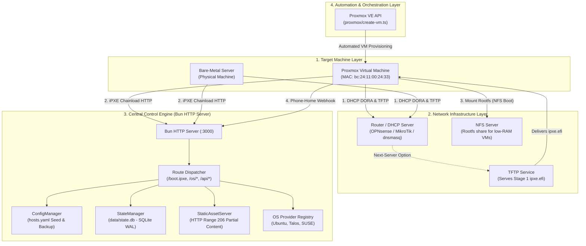
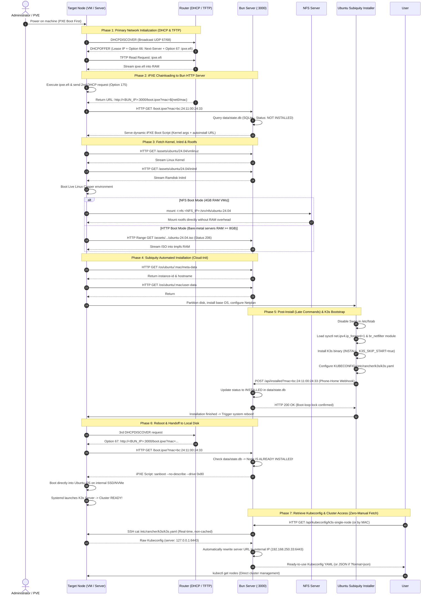

# Architecture & End-to-End Workflow (How It Works)

Welcome to the end-to-end architecture documentation of the **Bun Multi-OS iPXE & Cloud-Init Server**.

This document explains the comprehensive big picture of how a blank, unconfigured machine (Bare-Metal server or Proxmox VE virtual machine) transforms into a fully functional Kubernetes (**K3s**) node from a single power-on trigger (**Zero-Touch Provisioning - ZTP**).

---

## 1. System Architecture Diagram

---

## 2. End-to-End Sequence Diagram

Below is the real-time interaction lifecycle from node power-on until the Kubernetes cluster reaches a stable, ready state:

---

## 3. Lifecycle Boot Phases

The system operates smoothly by establishing clear boundaries across 7 sequential phases:

| Phase | Responsible Entity | Core Function | Handoff Mechanism |
| :--- | :--- | :--- | :--- |
| **Phase 1: Hardware POST** | Motherboard / NIC PXE ROM | Hardware initialization, enable PXE ROM. | Broadcasts DHCPDISCOVER packet. |
| **Phase 2: Stage 1 iPXE** | TFTP Server | Load `ipxe.efi` (~1MB binary) into RAM memory. | Executes iPXE binary inside EFI environment. |
| **Phase 3: Stage 2 HTTP** | Bun HTTP Server | Query MAC in `data/state.db` (SQLite) and generate customized iPXE boot script. | iPXE `kernel` and `initrd` commands fetch Linux assets. |
| **Phase 4: Live OS Boot** | Linux Casper Environment | Mount root filesystem via **NFS** or load **ISO into RAM tmpfs**. | Launches Canonical's `subiquity` installer process. |
| **Phase 5: Subiquity Engine** | Cloud-Init & Curtin | Fetch configuration from `/os/ubuntu/:mac/user-data`, partition disk, run late-commands. | Fires Phone-Home Webhook `/api/installed` and triggers `reboot`. |
| **Phase 6: Production Run** | Local Disk / K3s / RKE2 | iPXE detects installed state -> executes `sanboot 0x80`. | System boots into OS on local disk; Kubernetes cluster ready. |
| **Phase 7: Cluster Access** | Bun Kubeconfig API | Serves `GET /api/kubeconfig/:identifier` with real-time SSH query and automated IP rewriting. | Delivers ready-to-use YAML/JSON for remote `kubectl` access. |

---

## 4. Declarative Infrastructure Model

The system strictly adheres to **Infrastructure as Code (IaC)** principles. Operators never need to run manual commands on target nodes; all definitions reside declaratively in `config/hosts.yaml`:

1. **Default Configuration Block (`default`)**: Applied to any unrecognized MAC address (Plug-and-play Zero-Touch Provisioning).
2. **Host Configuration Block (`hosts`)**: Per-MAC granular overrides:
   - Hostname, static IP / Netmask / Gateway / DNS.
   - Target Operating System (`ubuntu`, `talos`, `suse-micro`).
   - Specific OS Profile (`k3s-single-node`, `generic`).
   - Rootfs delivery mechanism (`boot_method: nfs` for low-RAM VMs or `boot_method: http` for physical servers).
   - Target installation disk (`target_disk: /dev/sda` or `/dev/nvme0n1`).

---

## 5. Master Navigation Hub

For deeper insights into specific technical components, explore our comprehensive topic guides:

- 🌐 [**Network Protocols & Router Setup** (`network-protocols.md`)](network-protocols.md):
  * In-depth DHCP DORA breakdown and DHCP Options 66, 67, 60, 93, 175.
  * Technical mechanics of Two-Stage Chainloading.
  * Ready-to-use configuration templates for OPNsense/pfSense, MikroTik, dnsmasq, and OpenWrt.
- ⚙️ [**OS Installation Engines** (`os-engines.md`)](os-engines.md):
  * Comprehensive breakdown of Casper, Subiquity Autoinstall, and Cloud-Init.
  * Rootfs delivery showdown: HTTP Range 206 Partial Content vs. NFS Stream Boot.
  * Architectural dissection of the `k3s-single-node` (Ubuntu) and `rke2-single-node` (openSUSE) profiles.
  * Talos Linux MachineConfig and openSUSE Combustion deep dives.
  * Two-tier Provider Registry & Profile Registry Map architecture.
  * Step-by-step guide to adding custom OS Providers and Profiles.
- 🛡️ [**Anti-Boot Loop & State Machine** (`anti-boot-loop.md`)](anti-boot-loop.md):
  * Resolving the infinite boot-loop paradox in Zero-Touch Provisioning.
  * Hardware handoff via `sanboot --drive 0x80 || exit 1`.
  * State Machine architecture with SQLite WAL (`data/state.db`) and Phone-Home Webhooks.
  * Failure recovery scenarios and forced re-installation workflows (`force_install`).
- 🩺 [**Diagnostic & Troubleshooting Handbook** (`troubleshooting.md`)](troubleshooting.md):
  * Layered triage guide from L1/L2 physical networking to Subiquity and Kubernetes.
  * Resolving OOM Killer crashes on memory-constrained 4GB–5GB VMs.
  * Enabling the Emergency Shell and streaming live installation logs in real time.
  * Rapid diagnostic symptom matrix and emergency rescue command reference.
