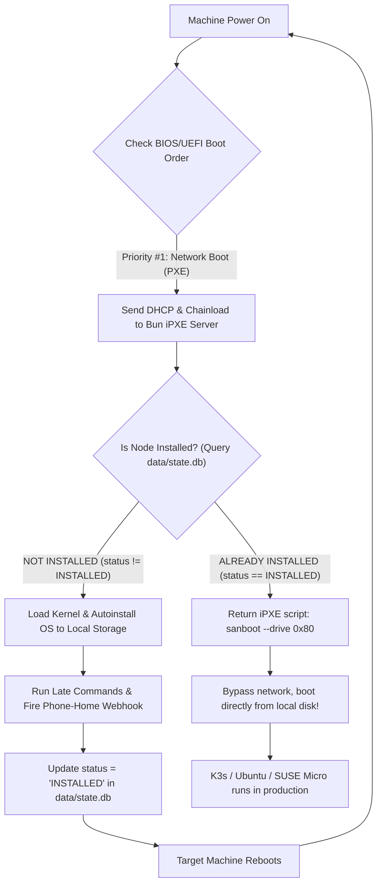

# Anti-Boot Loop Mechanism & State Machine Engine

This document details the core paradox of **Zero-Touch Provisioning (ZTP)**, the internal design of the system's **State Machine**, the **Hardware Handoff** mechanism via `sanboot`, and the fail-safe boot-loop prevention protocol powered by **Phone-Home Webhooks**.

---

## 1. The ZTP Boot Dilemma (Infinite Reinstall Paradox)

To achieve true **Zero-Touch Provisioning (ZTP)** (where powering on a new bare-metal or virtual machine triggers complete end-to-end installation without human keyboard/monitor intervention):
1. **Requirement**: The physical server or VM must have its BIOS/UEFI boot order configured with **Network Boot (PXE) as Priority #1**.
2. **The Dilemma**: Once the operating system (Ubuntu, Talos, openSUSE...) successfully installs to internal storage and triggers a `reboot`, the motherboard firmware cycles back to Priority #1: Network Boot!
3. **The Disaster**: Without a stateful memory mechanism, the iPXE server would serve the autoinstall script again. The machine would wipe its disk and fall into an **Infinite Reinstallation Loop**!



---

## 2. Hardware Handoff Mechanics (`sanboot`)

When the Bun server determines that a node has completed installation, it bypasses the OS installer menu and serves this specialized iPXE handoff script (defined in [src/routes/ipxe.ts](file:///Users/timi/lab/lab-ipxe-os/src/routes/ipxe.ts)):

```ipxe
#!ipxe
echo ==========================================================
echo Node [k3s-single-node] (bc:24:11:00:24:33) is ALREADY INSTALLED.
echo Bypassing network installation. Booting local disk...
echo (To reinstall, trigger API: POST http://192.168.250.202:3000/api/reset?mac=bc:24:11:00:24:33)
echo ==========================================================
sleep 2
sanboot --no-describe --drive 0x80 || exit 1
```

### 2.1. How `sanboot --no-describe --drive 0x80` Works
- `0x80` (Hexadecimal) designates the **First Physical Hard Drive** in traditional BIOS `INT 13h` interrupt architecture.
- In modern UEFI environments, iPXE translates `0x80` into the first local storage device compliant with the **UEFI Block I/O Protocol**.
- The `--no-describe` flag instructs iPXE not to construct complex virtual SAN device descriptions in ACPI memory tables. This allows immediate, clean control transfer to the local Master Boot Record (MBR) or EFI System Partition (ESP) without kernel boot interference.

### 2.2. Fail-Safe Fallback: `|| exit 1`
If `sanboot` encounters an anomaly (e.g., target storage lacks a bootloader or vendor firmware fails to execute iPXE interrupts):
- `exit 1` causes the iPXE EFI Application (`ipxe.efi`) to exit with an error code.
- As soon as iPXE exits non-zero, the motherboard's **UEFI Boot Manager (NVRAM)** automatically falls back to the next boot entry in the priority list (typically the `ubuntu` entry pointing to `\EFI\ubuntu\shimx64.efi` on local disk).

### 2.3. UEFI NVRAM Boot Order Protection (`efibootmgr` late-command)
On modern bare-metal systems (such as Intel Gen 12+ LGA1700 or AMD AM5 boards), default OS installations run `grub-install`, which forcibly prepends `ubuntu` as Priority #1 in the NVRAM `BootOrder`. This causes subsequent reboots to bypass network boot entirely.

To preserve ZTP lifecycle management, the project incorporates an automated `efibootmgr` script in Ubuntu Autoinstall `late-commands` ([src/providers/ubuntu/profiles/index.ts](file:///Users/timi/lab/lab-ipxe-os/src/providers/ubuntu/profiles/index.ts)):
1. Detects the network interface `BootID` (`IPv4` / `PXE` / `Network`).
2. Re-sequences `BootOrder` to place Network Boot back at **#1**, keeping `ubuntu` at **#2**.
3. **Dual Benefit**:
   - **When iPXE Server is online**: Nodes always boot into iPXE, allowing the server to orchestrate re-installs or issue `sanboot`.
   - **When iPXE Server is offline / network unplugged**: Motherboard firmware automatically falls back to Priority #2 (`ubuntu` on SSD), ensuring zero downtime.

---

## 3. Bun Server State Machine Architecture

All installation lifecycle state logic is centralized in the `StateManager` class located at [src/core/state.ts](file:///Users/timi/lab/lab-ipxe-os/src/core/state.ts).

### 3.1. Database Schema: `hosts` Table in `data/state.db` (SQLite)
Lifecycle status and host parameters are durably stored in SQLite with full ACID guarantees (`PRAGMA journal_mode = WAL`):

```sql
SELECT mac, hostname, os, status, ip, installed_at, updated_at FROM hosts;
```

Example of a completed installation record:
```json
{
  "mac": "bc:24:11:00:24:33",
  "hostname": "k3s-single-node",
  "os": "ubuntu",
  "status": "INSTALLED",
  "ip": "192.168.250.33",
  "installed_at": "2026-09-14T07:25:39.124Z",
  "updated_at": "2026-09-14T07:25:39.124Z"
}
```

### 3.2. State Transition Lifecycle

```
[ UNCONFIGURED / NEW_NODE ]
            │
            ▼ (Created via Web UI "+ Add Node", REST API, or seeded from hosts.yaml)
       [ REGISTERED (PENDING) ]
            │
            ▼ (Client requests boot.ipxe & begins downloading Kernel/Initrd)
       [ PROVISIONING ]
            │
            ▼ (Subiquity / Combustion finishes installation -> Fires Phone-Home Webhook)
         [ INSTALLED ]  ◄── (Permanent Anti-Boot Loop Lock)
            │
            ├── (Subsequent reboots: Execute sanboot to boot local disk)
            │
            ▼ (Operator wishes to reinstall: Click "Reset" in Web UI or invoke Reset API)
       [ PENDING ] ──> Enables fresh reinstallation without losing host configuration!
```

---

## 4. Phone-Home Webhook Mechanism

Completion confirmation occurs 100% automatically from inside the newly provisioned machine.

As Subiquity finishes writing target filesystems and installing packages, it executes the target machine's `late-commands` inside chroot ([src/providers/ubuntu/profiles/index.ts](file:///Users/timi/lab/lab-ipxe-os/src/providers/ubuntu/profiles/index.ts)):

```bash
curtin in-target --target=/target -- curl -s -X POST \
  "http://192.168.250.202:3000/api/installed?mac=bc%3A24%3A11%3A00%3A24%3A33&hostname=k3s-single-node&os=ubuntu"
```

When the Bun server receives the request at `/api/installed` ([src/routes/api.ts](file:///Users/timi/lab/lab-ipxe-os/src/routes/api.ts)):
1. Normalizes MAC address (lowercase, colon-separated, strip `0x` prefixes).
2. Updates the host record in `data/state.db` to status `INSTALLED` and records timestamp `installed_at`.
3. Returns HTTP `200 OK`.
4. From that moment forward, any subsequent iPXE queries for that MAC address receive `sanboot 0x80`.

---

## 5. Re-Installation Workflow

When you need to reprovision an operating system on an `INSTALLED` node, four flexible methods are available:

### Method 1: Web UI Dashboard "Reset" Button (Fastest)
On the Web UI (`http://localhost:3000/`), locate the target host and click **Reset**:
- Node status immediately transitions back to `PENDING` (badge turns blue).
- All network configurations, profiles, and target disks remain safely preserved in SQLite.

### Method 2: Management API Call via cURL
Trigger an HTTP POST request to the `/api/reset` endpoint:
```bash
curl -X POST "http://192.168.250.202:3000/api/reset?mac=bc:24:11:00:24:33"
```
The server updates the host status to `PENDING`. On the next reboot, the node boots into the autoinstall menu.

### Method 3: Enable `force_install` via Web UI Edit or REST API
Click **Edit** in the dashboard or send `PUT /api/hosts/:mac` with `"force_install": true`.

### Method 4: Boot URL with Query Parameter `?force=true`
Directly from the iPXE CLI or router configuration:
```ipxe
chain --autofree http://192.168.250.202:3000/boot.ipxe?mac=${net0/mac}&force=true
```

---

## 6. Failure Recovery & Edge Cases

| Scenario | System Behavior | Resolution |
| :--- | :--- | :--- |
| **Power loss or network glitch mid-install** | Because failure occurred BEFORE `late-commands`, the webhook never fired -> Node remains in `PROVISIONING` or `PENDING`. When power restores, the node restarts installation cleanly from scratch. | Self-healing; no manual intervention needed. |
| **Webhook drops due to router network congestion** | The `\|\| true` pipe in late-commands ensures Subiquity finishes without fatal crash. However, the machine would reinstall on next boot. | Inspect firewall/ACL policies between the target subnet and Bun Server port 3000. |
| **Bun Server restarts or suffers power loss** | `bun:sqlite` with Write-Ahead Logging (WAL) guarantees full ACID durability. When the server restarts, host states are completely preserved. | Zero state loss for already provisioned nodes. |

---

## 7. Security Hardening Recommendations

1. **Subnet Access Control**:
   - Management endpoints such as `/api/installed`, `/api/reset`, `/api/hosts`, and `/api/kubeconfig` should strictly be restricted to internal lab/datacenter subnets (`192.168.250.0/24`). Never expose port 3000 directly to the public internet without an authenticated reverse proxy.
2. **State Locking via API Token (Recommended for Enterprise)**:
   - Configure an `ADMIN_API_TOKEN` environment variable in `.env`.
   - Restrict mutation endpoints (`/api/reset`, `/api/hosts`, `/api/installed`) by requiring an `Authorization: Bearer <TOKEN>` header to prevent unauthorized MAC spoofing requests.
