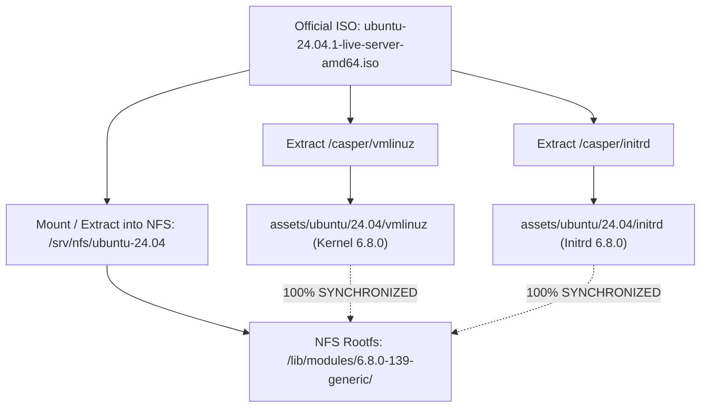

# Kernel/Rootfs Synchronization & netboot.xyz Integration Guide

This guide provides an architectural analysis of the relationship between the **Linux Kernel (`vmlinuz`)**, **Initial RAM Disk (`initrd`)**, and **Root Filesystem (Rootfs)** within a Network Boot environment (PXE / iPXE / netboot.xyz). It explains the root cause of the classic **`Kernel panic - not syncing: VFS: Unable to mount root fs on unknown-block(0,0)`** error, resolves the version skew paradox between "Floating Netboot Mirrors" and "Frozen ISO Releases", and establishes a **Single Source of Truth** methodology for future OS upgrades (e.g., Ubuntu 26.04 / Linux Kernel 7.x).

---

## 1. The 3-Stage Linux Network Boot Architecture

Unlike booting from physical local storage (where the UEFI bootloader reads the disk's EFI System Partition directly), network booting traverses three distinct operational stages:

```mermaid
sequenceDiagram
    autonumber
    participant Client as Target Client (RAM / BIOS)
    participant iPXE as iPXE / netboot.xyz Loader
    participant BunServer as Bun iPXE Server (:3000)
    participant Kernel as Linux Kernel (vmlinuz)
    participant Initrd as Ramdisk (/init - casper)
    participant RootFS as Rootfs (NFS 192.168.250.4 / ISO)

    Client->>iPXE: Initialize NIC (PXE ROM / netboot.xyz)
    iPXE->>BunServer: Fetch boot.ipxe & Assets (vmlinuz, initrd)
    BunServer-->>iPXE: Stream Kernel & Initrd into target host RAM
    iPXE->>Kernel: Execute 'boot' command; transfer CPU control
    Note over Kernel: Stage 1: Core hardware & memory initialization
    Kernel->>Initrd: Stage 2: Decompress Ramdisk & launch /init script
    Note over Initrd: casper initializes network stack to discover Rootfs
    Initrd->>RootFS: Stage 3: Mount NFS share /srv/nfs/ubuntu-xx.xx
    RootFS-->>Initrd: Successfully mounts root filesystem hierarchy (/)
    Initrd->>RootFS: Dynamically loads hardware modules from /lib/modules/<version>/
    Initrd->>Kernel: Perform switch_root into production rootfs
    Kernel->>Client: Execute Canonical Subiquity Autoinstall
```

### The Inviolable Rule of Linux Kernels:
> **The kernel version of `vmlinuz` MUST match 100% with the directory name in `/lib/modules/<kernel-version>/` located on the Rootfs (NFS server or ISO squashfs image).**

* `vmlinuz` is a minimal, compressed monolithic kernel; it cannot embed drivers for thousands of network cards and storage controllers into a single 15MB file.
* Hardware drivers (e.g., Realtek r8169, Intel e1000e, igc 2.5GbE, NFS client, OverlayFS) are compiled as modular objects (`.ko`) stored under `/lib/modules/$(uname -r)/`.
* If `vmlinuz` is version **7.0.0**, but the rootfs only provides `/lib/modules/6.8.0-139-generic/`, the 7.0 kernel **cannot load required network and disk drivers** $\rightarrow$ the operating system panics before reaching userspace.

---

## 2. Deciphering: `Kernel panic - not syncing: VFS: Unable to mount root fs on unknown-block(0,0)`

This is the most notorious failure in bare-metal network installations:

```
[    1.482910] List of all partitions:
[    1.483102] No filesystem could mount root, tried: 
[    1.483250] Kernel panic - not syncing: VFS: Unable to mount root fs on unknown-block(0,0)
[    1.483420] CPU: 2 PID: 1 Comm: swapper/0 Not tainted 6.8.0-139-generic #139-Ubuntu
[    1.483590] Hardware name: Default string Default string/B760M, BIOS 1.00 05/10/2024
[    1.483750] Call Trace:
[    1.483850]  <TASK>
[    1.483950]  dump_stack_lvl+0x48/0x70
[    1.484100]  panic+0x340/0x380
[    1.484250]  mount_block_root+0x1a8/0x240
[    1.484400]  mount_root+0x38/0x50
[    1.484550]  prepare_namespace+0x138/0x180
[    1.484700]  kernel_init+0x18/0x140
[    1.484850]  </TASK>
```

### 2.1. Kernel Execution Flow
In Linux kernel source code (`init/main.c` and `init/do_mounts.c`):
1. `kernel_init()` finishes basic initialization and attempts to decompress the `initrd` payload into a temporary `ramfs`.
2. It verifies whether an executable `/init` script exists in `ramfs` (`try_to_run_init_process("/init")`).
3. **If `/init` fails to execute** (due to missing initrd, corrupted ramdisk archive, or buffer exhaustion), the kernel falls back to the legacy disk root mechanism (`root=`).
4. Since network boot configurations specify no local hard disk root device (or default to major:minor `0:0`), the kernel triggers `panic("VFS: Unable to mount root fs on %s", "unknown-block(0,0)")`!

### 2.2. Three Root Causes & Architectural Fixes

| # | Root Cause | Failure Mechanism | Definitive Fix |
| :- | :--- | :--- | :--- |
| **1** | **`initrd=initrd` Argument Conflict in UEFI Boot Stub** | On modern UEFI bare-metal systems, Kernel 6.x/7.x relies on **`EFI_LOAD_FILE2_PROTOCOL`** to receive initrd from iPXE. Passing `initrd=initrd` on the command line leads the EFI Stub to search for a physical disk file named `initrd` on the ESP partition. When not found, it **ignores the loaded initrd in RAM** entirely! | Omit `initrd=initrd` from the `kernel` command line; let iPXE register via `LoadFile2`. |
| **2** | **iPXE Memory Buffer Collisions with netboot.xyz (Missing `imgfree`)** | netboot.xyz pre-allocates memory for fonts, menus, and SSL certificates in iPXE RAM. Chainloading without `imgfree` causes iPXE to append new initrd data to existing buffers, producing a corrupt archive (`Initramfs unpacking failed: junk in compressed archive`). | Issue **`imgfree`** at the beginning of the boot script to clear memory. |
| **3** | **Ramdisk Buffer Limits (`ramdisk_size` too low)** | The Ubuntu 24.04 (Noble) initrd contains uncompressed NIC firmware (~50MB) and compressed rootfs layers. Decompression requires over 2GB of headroom. A setting of `ramdisk_size=1500000` (1.5GB) overflows during decompression. | Increase the allocation to **`ramdisk_size=3500000`** (3.5GB) following netboot.xyz standards. |

---

## 3. Version Skew: "Floating Netboot Mirror" vs. "Frozen ISO Release"

Why do `vmlinuz` and `/srv/nfs/ubuntu-24.04` rootfs directories often drift out of sync?

```
┌─────────────────────────────────────────────────────────────────────────────┐
│  Live Online Mirror: releases.ubuntu.com/24.04/netboot/amd64/linux          │
│  => Canonical updates continuously: BUMPS TO KERNEL 7.0.0-31 (HWE)          │
└─────────────────────────────────────────────────────────────────────────────┘
                                  VS
┌─────────────────────────────────────────────────────────────────────────────┐
│  Frozen Release ISO: ubuntu-24.04.1-live-server-amd64.iso                   │
│  => SHA256 checksum is static: SHIPPED WITH GA KERNEL 6.8.0-139 (Generic)   │
│  => /lib/modules/ inside Rootfs ONLY contains drivers for 6.8.0-139         │
└─────────────────────────────────────────────────────────────────────────────┘
                                  ||
                                  ▼
                   ❌ KERNEL VERSION MISMATCH ❌
        Kernel 7.0 boots up but cannot locate 7.0 driver modules on NFS!
```

* **ISO Images are Frozen Releases**: To guarantee SHA256 integrity, distribution maintainers never mutate an ISO once published. The squashfs filesystem and `/lib/modules/` inside 24.04.1 contain only Kernel 6.8.0-139.
* **Netboot Web Folders are Floating Mirrors**: Upstream mirrors frequently update to provide current Hardware Enablement (HWE) kernels.
* **Architectural Rule**: **NEVER** download the kernel from an online mirror while sourcing the rootfs/ISO from a separate image. Both must originate from the exact same artifact.

---

## 4. Single Source of Truth Architecture (Extracted Directly from ISO)

To eliminate version skew across any distribution (Ubuntu 24.04, 26.04, Debian, or RHEL), the project standardizes on the **Single Source of Truth** model:



### Standardized Extraction Command Using `bsdtar`:
```bash
# Extract kernel and initrd directly from inside the ISO
bsdtar -xf assets/ubuntu/24.04/ubuntu-24.04-live-server-amd64.iso -C /tmp casper/vmlinuz casper/initrd
mv /tmp/casper/vmlinuz assets/ubuntu/24.04/vmlinuz
mv /tmp/casper/initrd assets/ubuntu/24.04/initrd
rm -rf /tmp/casper
```

> [!TIP]
> Ubuntu ISOs contain two kernel pairs:
> 1. **GA Kernel (Generic)**: `/casper/vmlinuz` + `/casper/initrd` (Default recommendation for maximum stability).
> 2. **HWE Kernel (Hardware Enablement)**: `/casper/hwe-vmlinuz` + `/casper/hwe-initrd` (Recommended for cutting-edge CPU/motherboard architectures).

---

## 5. Standardized iPXE Boot Script (netboot.xyz & Bare-Metal Compatible)

Defined in [src/providers/ubuntu/ipxe.ts](file:///Users/timi/lab/lab-ipxe-os/src/providers/ubuntu/ipxe.ts):

```ipxe
#!ipxe
# ==========================================================
# Homelab Ubuntu 24.04 ZTP Provisioning Script
# ==========================================================

# 1. Purge residual memory buffers from netboot.xyz
imgfree

set base_url http://192.168.250.202:3000

echo [*] Loading Linux Kernel (Single Source of Truth)...
# 2. Standardized kernel parameters for UEFI & Casper
# - root=/dev/ram0: Designate RAM disk target
# - ramdisk_size=3500000: Provide 3.5GB decompression buffer
# - cloud-config-url=/dev/null: Prevent Subiquity from hanging on metadata discovery
# - ds=nocloud-net: Designate Autoinstall user-data endpoint
kernel ${base_url}/assets/ubuntu/24.04/vmlinuz root=/dev/ram0 ramdisk_size=3500000 boot=casper netboot=nfs nfsroot=192.168.250.4:/srv/nfs/ubuntu-24.04 ip=dhcp autoinstall ds=nocloud-net;s=${base_url}/os/ubuntu/${mac}/ cloud-config-url=/dev/null

echo [*] Loading Initrd Image...
initrd ${base_url}/assets/ubuntu/24.04/initrd

echo [*] Booting target machine...
boot
```

### Client-Side Rescue & Force Reinstall Script (`force.ipxe`):
When an administrator needs to force a fresh reinstallation via netboot.xyz:

```ipxe
#!ipxe
set base_url http://192.168.250.202:3000

echo =========================================================
echo [*] Homelab ZTP: TRIGGERING FORCE REINSTALL
echo [*] Server: ${base_url}
echo =========================================================

isset ${ip} || dhcp
set target_mac ${net0/mac}
isset ${target_mac} || set target_mac ${mac}

echo [*] Target MAC: ${target_mac}
sleep 1

# Purge netboot.xyz RAM buffers and chainload to Bun server
imgfree
chain --autofree ${base_url}/boot.ipxe?mac=${target_mac}&force=true&auto=1 || goto fail

:fail
echo [!] ERROR: Cannot connect to server ${base_url}!
shell
```

---

## 6. Future Upgrades: Adding Ubuntu 26.04 (Kernel 7.x)

When adding **Ubuntu 26.04** alongside existing 24.04 nodes without downtime:

### Step 1: Download Ubuntu 26.04 ISO to Server
```bash
mkdir -p assets/ubuntu/26.04
# Place the official ISO at:
# assets/ubuntu/26.04/ubuntu-26.04-live-server-amd64.iso
```

### Step 2: Prepare Rootfs on NFS Server (`192.168.250.4`)
```bash
sudo mkdir -p /srv/nfs/ubuntu-26.04
sudo mount -o loop /path/to/ubuntu-26.04-live-server-amd64.iso /mnt
sudo cp -a /mnt/* /srv/nfs/ubuntu-26.04/
sudo umount /mnt
```

### Step 3: Extract Kernel 7 & Initrd from the 26.04 ISO
```bash
bsdtar -xf assets/ubuntu/26.04/ubuntu-26.04-live-server-amd64.iso -C /tmp casper/vmlinuz casper/initrd
mv /tmp/casper/vmlinuz assets/ubuntu/26.04/vmlinuz
mv /tmp/casper/initrd assets/ubuntu/26.04/initrd
rm -rf /tmp/casper
```

### Step 4: Configure Node in `config/hosts.yaml`
```yaml
hosts:
  "e8:9c:25:7b:af:d8":
    hostname: "k3s-single-node-i5"
    os: ubuntu
    version: "26.04"                  # <--- Updated version
    profile: k3s-single-node
    custom:
      boot_method: nfs
      nfs_root: "192.168.250.4:/srv/nfs/ubuntu-${version}"
    storage:
      target_disk: "/dev/sda"
    force_install: true
```

The Bun server will automatically serve:
- Kernel: `http://192.168.250.202:3000/assets/ubuntu/26.04/vmlinuz` (Kernel 7)
- Initrd: `http://192.168.250.202:3000/assets/ubuntu/26.04/initrd`
- NFS Root: `192.168.250.4:/srv/nfs/ubuntu-26.04` (100% matched to Kernel 7 modules)

---

## 7. 5-Step Diagnostic Checklist

When a node encounters a Kernel Panic during network boot:

- [ ] **1. Kernel & Module Sync**: Do `vmlinuz` and `/lib/modules/` share the exact same release tag (`file vmlinuz` vs `ls /srv/nfs/.../lib/modules`)?
- [ ] **2. Verify `imgfree` Execution**: Does the iPXE script issue `imgfree` before loading the kernel (especially when chaining through netboot.xyz)?
- [ ] **3. Verify `ramdisk_size`**: Is the ramdisk buffer sized sufficiently (`ramdisk_size=3500000`)?
- [ ] **4. UEFI Command Line**: Has `initrd=initrd` been removed from the kernel command line to prevent UEFI Boot Stub conflicts?
- [ ] **5. NFS & HTTP Accessibility**: Verify asset availability via `curl -I http://192.168.250.202:3000/assets/ubuntu/24.04/vmlinuz` and check NFS exports using `showmount -e 192.168.250.4`.

---

## 8. Proxmox VE 9.2 Assets: Assistant-Generated (No Manual ISO Extraction)

Unlike Ubuntu/SUSE, the Proxmox VE kernel and initrd are **not extracted from the stock ISO by hand** — they must be generated with the official `proxmox-auto-install-assistant` (the pair embeds the pointer back to this server's `/os/proxmox/answer`):

```bash
apt install proxmox-auto-install-assistant xorriso

proxmox-auto-install-assistant prepare-iso proxmox-ve_9.2-1.iso \
  --fetch-from http --url "http://192.168.250.202:3000/os/proxmox/answer" \
  --pxe --pxe-loader ipxe --output ./proxmox-pxe/

# Payload ISO for the second initrd (see os-engines.md §4 why not the --pxe ISO)
proxmox-auto-install-assistant prepare-iso proxmox-ve_9.2-1.iso \
  --fetch-from http --url "http://192.168.250.202:3000/os/proxmox/answer" \
  --output proxmox-ve-9.2-auto.iso

mkdir -p assets/proxmox/9.2
cp ./proxmox-pxe/vmlinuz ./proxmox-pxe/initrd.img assets/proxmox/9.2/
cp proxmox-ve-9.2-auto.iso assets/proxmox/9.2/
```

Quick verification:

```bash
curl -I http://192.168.250.202:3000/assets/proxmox/9.2/vmlinuz
curl -I http://192.168.250.202:3000/assets/proxmox/9.2/initrd.img
curl -I http://192.168.250.202:3000/assets/proxmox/9.2/proxmox-ve-9.2-auto.iso
# Dry-run the answer for one node (no real installer needed):
curl "http://192.168.250.202:3000/os/proxmox/answer?mac=bc:24:11:00:24:40"
```

> [!NOTE]
> Because `vmlinuz`/`initrd.img` bake in the answer URL at `prepare-iso` time, re-run the command above and overwrite the assets whenever the server `baseUrl` changes.
