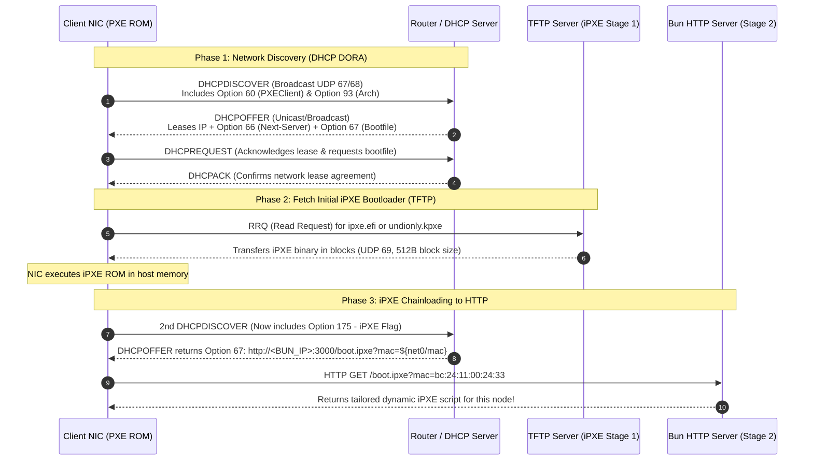

# Network Protocols & Router Setup

This document provides an in-depth analysis of low-level networking protocols responsible for initializing network booting (**Network Boot / PXE**), explains the mechanics of **Two-Stage Chainloading** with iPXE, and provides production-tested configuration recipes for leading Homelab and Data Center routers and DHCP servers.

---

## 1. PXE Boot Lifecycle & DHCP DORA Sequence

When a target machine (Bare-metal server or Virtual Machine) powers on with **PXE / Network Boot First** enabled in BIOS/UEFI, the motherboard initializes the Network Interface Card (NIC) firmware ROM.

Because the NIC has no operating system and no assigned IP address yet, it utilizes **DHCP (Dynamic Host Configuration Protocol)** over UDP port 67 (Server) and UDP port 68 (Client) following the standard **DORA** lifecycle:



---

## 2. Essential DHCP Options Decoded

A typical DHCP server merely provides an IP address, Subnet Mask, Default Gateway (Option 3), and DNS Servers (Option 6). For Network Booting, the following specialized options are required:

| DHCP Option | Standard Name | Technical Purpose | Value in This Project |
| :--- | :--- | :--- | :--- |
| **Option 66** | `Next-Server` / `tftp-server-name` | IP address of the primary bootloader server (TFTP Server). | `192.168.250.202` (or router IP if running embedded TFTP) |
| **Option 67** | `Bootfile-Name` | Path to the bootloader executable binary that ROM downloads and runs. | `ipxe.efi` (UEFI) or `undionly.kpxe` (BIOS) |
| **Option 60** | `Vendor-Class-Identifier` | String identifier confirming that the client making the DHCP request is a PXE card. | Strings starting with `PXEClient:Arch:xxxxx` |
| **Option 93** | `Client-System-Architecture` | CPU architecture and firmware type of the client machine. | `0` (x86 BIOS), `7` (x64 UEFI), `9` (x64 UEFI HTTP), `11` (ARM64) |
| **Option 175** | `iPXE Encapsulated Options` | Specialized data field injected by iPXE to advertise that the client **is already running iPXE**. | Used for conditional branching: prevents infinite loops between TFTP and HTTP! |

---

## 3. The Two-Stage Chainloading Paradigm & Why iPXE is Essential

### Inherent Limitations of Traditional PXE ROMs
1. **TFTP (Trivial File Transfer Protocol) is slow and fragile**:
   - Runs over UDP port 69.
   - Lock-step transmission (sends 512-byte blocks, requiring an ACK packet before transmitting the next block).
   - Downloading a 2.6GB ISO or 60MB kernel over TFTP can take 30–60+ minutes with high packet-drop sensitivity.
2. **Lack of HTTP/HTTPS Support**: Legacy NIC firmware cannot speak HTTP, cannot download assets from CDNs, and does not support HTTP Byte-Range requests.
3. **No Dynamic Scripting or Interactivity**: Cannot render interactive countdown menus or append hardware MAC addresses as query parameters to web endpoints.

### The Two-Stage Chainloading Solution
The project employs a robust **Two-Stage Chainloading** mechanism:
- **Stage 1 (Ultra-lightweight TFTP - < 1MB)**:
   - The client machine's native NIC ROM loads the **iPXE** binary (`ipxe.efi` for UEFI or `undionly.kpxe` for legacy BIOS).
   - Because the file is only a few hundred kilobytes, TFTP transfer completes in under 1 second.
- **Stage 2 (High-speed HTTP - Bun Engine)**:
   - Once loaded into RAM, iPXE re-initializes the network stack and issues a second DHCP request.
   - This time, iPXE includes **DHCP Option 175**. The router recognizes Option 175 and redirects `Bootfile-Name` (Option 67) to the HTTP endpoint:
     ```
     http://192.168.250.202:3000/boot.ipxe?mac=${net0/mac}
     ```
   - All subsequent large payloads (Linux Kernel `vmlinuz` 60MB, `initrd` 120MB, ISO 2.6GB) stream over HTTP from Bun at multi-gigabit speeds.

---

## 4. Router & DHCP Configuration Guides

### 4.1. OPNsense / pfSense

Both OPNsense and pfSense offer built-in **Network Booting** support directly within the DHCP Server interface settings.

#### Steps for OPNsense:
1. Navigate to **Services** -> **DHCPv4** -> Select your target interface (e.g., `LAN` or `VLAN_SERVERS`).
2. Scroll to the **Network Booting** section:
   - Check **Enable Network Booting**.
   - **Next-Server**: Enter your TFTP/iPXE server IP, e.g., `192.168.250.202`.
   - **Default BIOS file name**: Enter `undionly.kpxe`.
   - **UEFI 32 bit file name**: Enter `ipxe-i386.efi`.
   - **UEFI 64 bit file name**: Enter `ipxe.efi`.
   - **ARM 64 bit file name**: Enter `ipxe-arm64.efi`.
3. Click **Save** and **Apply Changes**.

> [!TIP]
> To route directly to the Bun iPXE HTTP URL once iPXE is loaded, configure dnsmasq or Kea DHCP / ISC DHCP Custom Options to match the condition `exists user-class and option user-class = "iPXE"`.

---

### 4.2. MikroTik RouterOS

On MikroTik RouterOS, use **DHCP Option Sets** paired with a **Matcher** to differentiate standard PXE clients from clients already running iPXE.

#### Configuration Script for RouterOS Terminal:
```routeros
# 1. Create Option 66 (Next Server)
/ip dhcp-server option
add code=66 name=tftp_server value="'192.168.250.202'"

# 2. Create Option 67 for Stage 1 (UEFI iPXE binary via TFTP)
add code=67 name=bootfile_uefi value="'ipxe.efi'"

# 3. Create Option 67 for Stage 2 (Bun HTTP Script)
add code=67 name=bootfile_http value="'http://192.168.250.202:3000/boot.ipxe'"

# 4. Group into Option Sets
add name=set_pxe_stage1 options=tftp_server,bootfile_uefi
add name=set_pxe_stage2 options=bootfile_http

# 5. Attach Stage 1 Option Set to DHCP Network
/ip dhcp-server network
set [find address="192.168.250.0/24"] dhcp-option=set_pxe_stage1

# 6. Create Matcher to automatically detect iPXE (Option 175) and switch to Stage 2
/ip dhcp-server matcher
add address-pool="" code=175 name=match_ipxe server=defconf dhcp-option=set_pxe_stage2
```

---

### 4.3. dnsmasq (Standard on Linux, Raspberry Pi, Pi-hole)

`dnsmasq` is the most flexible tool for iPXE network configurations due to its lightweight tag-matching engine.

Edit `/etc/dnsmasq.d/pxe.conf` (or `/etc/dnsmasq.conf`):

```ini
interface=eth0

# Enable integrated TFTP and specify directory containing ipxe.efi
enable-tftp
tftp-root=/var/lib/tftpboot

# 1. Match architecture codes (Option 93)
dhcp-match=set:bios,option:client-arch,0
dhcp-match=set:efi-x86,option:client-arch,6
dhcp-match=set:efi-x64,option:client-arch,7
dhcp-match=set:efi-x64,option:client-arch,9
dhcp-match=set:efi-arm64,option:client-arch,11

# 2. Match if client is already running iPXE (Option 175)
dhcp-match=set:ipxe,175

# 3. Conditional Bootfile allocation:
# If client is iPXE -> serve HTTP script from Bun server immediately
dhcp-boot=tag:ipxe,http://192.168.250.202:3000/boot.ipxe?mac=${net0/mac}

# If not iPXE yet -> serve architecture-matched binary via TFTP
dhcp-boot=tag:bios,undionly.kpxe,,192.168.250.202
dhcp-boot=tag:efi-x64,ipxe.efi,,192.168.250.202
dhcp-boot=tag:efi-arm64,ipxe-arm64.efi,,192.168.250.202
```

Restart the service:
```bash
sudo systemctl restart dnsmasq
```

---

### 4.4. OpenWrt

On OpenWrt, DHCP is handled by `dnsmasq`. Modify `/etc/config/dhcp`:

```uci
config boot 'linux'
    option filename 'ipxe.efi'
    option serverdir '/var/tftpboot'
    option serveraddress '192.168.250.202'

config match 'ipxe_stage2'
    option network 'lan'
    option match '175'
    option boot 'http://192.168.250.202:3000/boot.ipxe?mac=${net0/mac}'
```

Alternatively, append the `dhcp-match` and `dhcp-boot` directives directly to `/etc/dnsmasq.conf`.

---

### 4.5. Zero-Router-Modification Alternative: netboot.xyz

If you lack administrative privileges on your home router:
1. Burn **netboot.xyz** to a USB flash drive or attach `netboot.xyz.iso` to a Proxmox virtual machine.
2. Boot into the netboot.xyz graphical menu.
3. Select **"Custom URLs"** or press `c` to enter the interactive iPXE CLI.
4. Manually chainload the Bun server script:
   ```ipxe
   chain --autofree http://192.168.250.202:3000/boot.ipxe?mac=${net0/mac}
   ```

---

## 5. Packet Inspection & Network Troubleshooting

If a target machine powers on but hangs at a black screen or shows `PXE-E11: ARP timeout` / `PXE-E32: TFTP open timeout`, capture packets on the server to diagnose the handshake:

### Capture DHCP & TFTP traffic on Linux:
```bash
# Listen on all interfaces for DHCP (ports 67/68) and TFTP (port 69)
sudo tcpdump -i any -n -v "port 67 or port 68 or port 69"
```

### Wireshark Filter for PXE Triage:
```wireshark
bootp || tftp || http
```

**Key Verification Checklist**:
1. In **DHCPOFFER** and **DHCPACK** frames:
   - `Next server IP address` matches your TFTP server IP.
   - `Boot file name` correctly specifies `ipxe.efi`.
2. In **TFTP** transactions:
   - The client sends a `Read Request (RRQ)` for `ipxe.efi`.
   - The TFTP server responds with `Data Packet (Block 1)` rather than `File not found (1)`.
3. In **HTTP** traffic:
   - Immediately following iPXE boot, a `GET /boot.ipxe?mac=...` request arrives on port 3000 of the Bun server.
