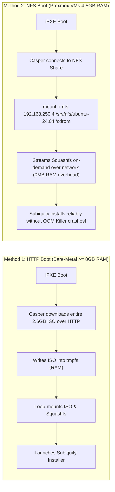
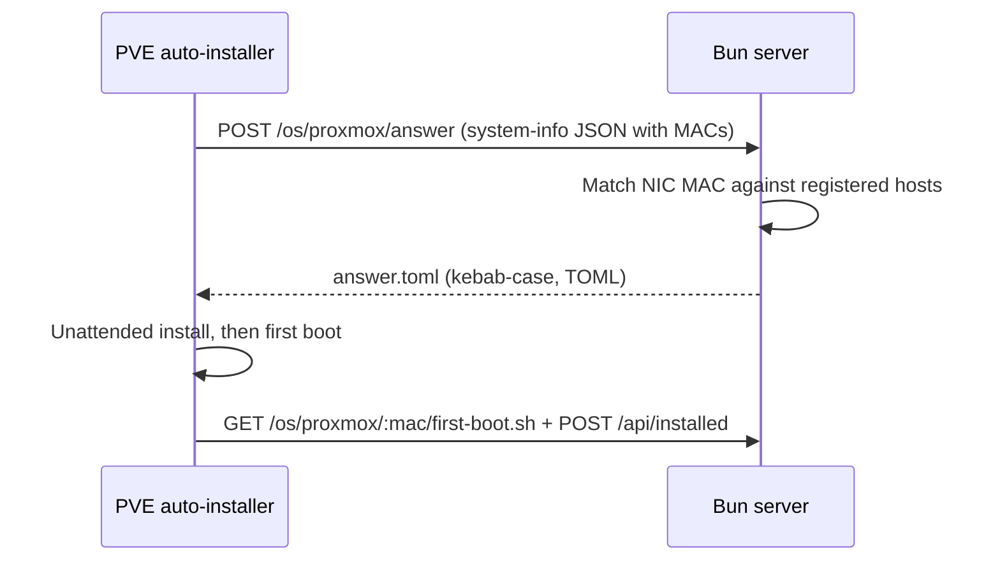
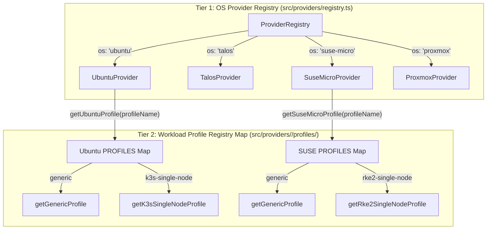

# OS Provisioning Engines

This document explains the internal mechanisms of the **Automated OS Engines** integrated into the project: **Ubuntu Server 24.04 (Subiquity / Cloud-Init)**, **Talos Linux (MachineConfig)**, **openSUSE Leap Micro (Combustion)**, and **Proxmox VE 9.2 (Automated Installation)**. It also provides developer instructions for extending the architecture to support additional Linux distributions.

---

## 1. Ubuntu Server 24.04 LTS: Casper & Subiquity Autoinstall

Starting with 20.04 LTS, Ubuntu Server completely deprecated the legacy Debian-Installer (Preseed) in favor of **Subiquity**, which operates in conjunction with the **Casper live boot environment** and **Cloud-Init**.

### 1.1. Casper Boot Flow & Kernel Arguments

When iPXE loads the Linux Kernel (`vmlinuz`) and Ramdisk (`initrd`), it passes specific parameters into the Kernel Command Line (defined in [src/providers/ubuntu/ipxe.ts](file:///Users/timi/lab/lab-ipxe-os/src/providers/ubuntu/ipxe.ts)):

```ipxe
kernel ${base_url}/assets/ubuntu/24.04/vmlinuz initrd=initrd \
  boot=casper \
  ip=dhcp \
  autoinstall \
  ds=nocloud-net;s=${base_url}/os/ubuntu/${mac}/ \
  [rootfs-loading-args]
```

**Core Parameters Breakdown**:
- `boot=casper`: Signals initrd that the system is booting Ubuntu's Live ISO environment. Casper handles locating and mounting the compressed `rootfs` filesystem (`filesystem.squashfs`).
- `autoinstall`: Activates Subiquity's non-interactive, unattended installation mode, bypassing interactive setup screens (keyboard, language, timezone).
- `ds=nocloud-net;s=...`: Directs Cloud-Init to consume configuration via the `nocloud-net` DataSource served by the Bun server URL.
  - Subiquity queries two HTTP endpoints:
    1. `${base_url}/os/ubuntu/${mac}/meta-data`: Returns `instance-id` and `local-hostname`.
    2. `${base_url}/os/ubuntu/${mac}/user-data`: Returns the full `#cloud-config` YAML declaration.

---

### 1.2. Rootfs Delivery Showdown: HTTP Boot vs. NFS Boot

Choosing the appropriate rootfs delivery method is critical for homelab resource optimization:



| Criteria | HTTP Boot (`boot_method: http`) | NFS Boot (`boot_method: nfs`) |
| :--- | :--- | :--- |
| **Boot Parameter** | `url=${base_url}/assets/.../ubuntu-24.04-live-server.iso` | `netboot=nfs nfsroot=192.168.250.4:/srv/nfs/ubuntu-24.04` |
| **Loading Mechanism** | Downloads complete 2.6GB ISO into volatile memory (`tmpfs`). | Mounts extracted ISO filesystem remotely via NFS v3/v4 protocol. |
| **Minimum RAM Requirement** | **≥ 8GB RAM**. On 4GB–5GB nodes, Subiquity will crash due to the Linux Kernel OOM Killer. | **4GB RAM** (Even 3GB RAM virtual machines provision reliably). |
| **Infrastructure Dependency** | **None** (Bun HTTP Server serves all assets self-contained). | Requires an internal NFS share (Synology NAS, TrueNAS, or Linux NFS). |
| **Best Used For** | Bare-metal physical servers with ample physical memory. | Proxmox VE virtual machines and memory-constrained clusters. |

---

### 1.3. HTTP Range Requests (Status 206) for Large Assets

To stream multi-gigabyte ISO files reliably, Bun's static file engine in [src/core/static-server.ts](file:///Users/timi/lab/lab-ipxe-os/src/core/static-server.ts) natively processes HTTP `Range: bytes=start-end` request headers:

```typescript
// Excerpt from src/core/static-server.ts
const rangeHeader = req.headers.get("range");
if (rangeHeader && rangeHeader.startsWith("bytes=")) {
  const parts = rangeHeader.replace(/bytes=/, "").split("-");
  const start = parseInt(parts[0], 10);
  const end = parts[1] ? parseInt(parts[1], 10) : stat.size - 1;
  const chunkLength = end - start + 1;
  const slicedFile = file.slice(start, end + 1);

  return new Response(slicedFile, {
    status: 206,
    headers: {
      "Content-Range": `bytes ${start}-${end}/${stat.size}`,
      "Accept-Ranges": "bytes",
      "Content-Length": chunkLength.toString(),
      "Content-Type": file.type || "application/octet-stream",
    },
  });
}
```

Through **206 Partial Content** responses, Linux Casper can selectively inspect ISO headers and sectors without buffering the entire file upfront, while seamlessly resuming interrupted downloads.

---

### 1.4. Anatomy of Subiquity `#cloud-config` (`user-data`)

The autoinstall file dynamically rendered at [src/providers/ubuntu/autoinstall.ts](file:///Users/timi/lab/lab-ipxe-os/src/providers/ubuntu/autoinstall.ts) configures key subsystems:

1. **Identity & Access (`identity` & `ssh`)**:
   - Creates the default administrative user (`homelab`) with SHA-512 hashed password.
   - Injects authorized SSH public keys defined in `config/hosts.yaml` into `~/.ssh/authorized_keys`.
2. **Storage Layout (`storage`)**:
   - `layout.name: direct` utilizes full drive capacity without LVM partitioning complexity.
   - Specifies target block devices via `layout.match.path` (`/dev/sda`, `/dev/vda`, or `/dev/nvme0n1`).
3. **Networking (`network`)**:
   - Generates Netplan version 2 declarations.
   - Supports dynamic DHCP and full static addressing (Static IP, Subnet CIDR, Default Gateway, DNS Nameservers).
4. **Late Commands Execution (`late-commands`)**:
   - Runs post-install operating system customizations prior to rebooting.
   - Executed via `curtin in-target --target=/target -- <command>`, operating directly within the target root chroot.

---

### 1.5. Deep Dive: The `k3s-single-node` Profile

The `k3s-single-node` profile is modularly structured in [src/providers/ubuntu/profiles/k3s-single-node.ts](file:///Users/timi/lab/lab-ipxe-os/src/providers/ubuntu/profiles/k3s-single-node.ts), turning a clean Ubuntu installation into a production-grade single-node Kubernetes cluster:

```typescript
lateCommands: [
  // 1. Permanently disable Swap in /etc/fstab (required by Kubernetes Kubelet)
  `curtin in-target --target=/target -- sed -i '/ swap / s/^\\(.*\\)$/#\\1/g' /etc/fstab || true`,

  // 2. Tune Kernel Sysctl for Kubernetes networking (Bridge Netfilter & IP Forwarding)
  `curtin in-target --target=/target -- sh -c 'cat <<EOF > /etc/sysctl.d/99-kubernetes.conf
net.bridge.bridge-nf-call-iptables  = 1
net.bridge.bridge-nf-call-ip6tables = 1
net.ipv4.ip_forward                 = 1
EOF'`,

  // 3. Automatically load essential Kernel Modules on system boot
  `curtin in-target --target=/target -- sh -c 'cat <<EOF > /etc/modules-load.d/k8s.conf
overlay
br_netfilter
EOF'`,

  // 4. Create directory and K3s declarative configuration (/etc/rancher/k3s/config.yaml) with TLS SAN
  `curtin in-target --target=/target -- mkdir -p /etc/rancher/k3s`,
  `curtin in-target --target=/target -- sh -c 'cat <<EOF > /etc/rancher/k3s/config.yaml
write-kubeconfig-mode: "0644"
tls-san:
${sanEntries}
EOF'`,

  // 5. Dynamic fallback: append actual leased IP to tls-san if DHCP is utilized
  `curtin in-target --target=/target -- sh -c 'NODE_IP=$(ip -4 route get 1.1.1.1 2>/dev/null | awk "{print \\$7}"); if [ -n "$NODE_IP" ] && ! grep -q "$NODE_IP" /etc/rancher/k3s/config.yaml; then echo "  - \\"$NODE_IP\\"" >> /etc/rancher/k3s/config.yaml; fi'`,

  // 6. Download and install K3s binary & systemd service (version pinning supported via host.custom.k3s_version)
  `curtin in-target --target=/target -- sh -c 'curl -sfL https://get.k3s.io | ${k3sVersionEnv}INSTALL_K3S_SKIP_START=true sh -'`,

  // 7. Enable systemd k3s unit to initialize immediately upon first boot
  `curtin in-target --target=/target -- systemctl enable k3s || true`,

  // 8. Configure system-wide KUBECONFIG environment variable and user ~/.kube/config symlinks
  `curtin in-target --target=/target -- sh -c 'echo "KUBECONFIG=/etc/rancher/k3s/k3s.yaml" >> /etc/environment'`,
  `curtin in-target --target=/target -- sh -c 'echo "export KUBECONFIG=/etc/rancher/k3s/k3s.yaml" > /etc/profile.d/k3s.sh'`,
  `curtin in-target --target=/target -- mkdir -p /home/${defaultUser}/.kube /root/.kube`,
  `curtin in-target --target=/target -- ln -sf /etc/rancher/k3s/k3s.yaml /home/${defaultUser}/.kube/config`,
  `curtin in-target --target=/target -- ln -sf /etc/rancher/k3s/k3s.yaml /root/.kube/config`,
  `curtin in-target --target=/target -- chown -R ${defaultUser}:${defaultUser} /home/${defaultUser}/.kube || true`,

  // 9. Enable QEMU Guest Agent for Proxmox VE IP/status reporting
  `curtin in-target --target=/target -- systemctl enable qemu-guest-agent || true`,

  // 10. Fire Phone-Home Webhook to Bun Server to confirm install completion & lock Boot Loop!
  `curtin in-target --target=/target -- curl -s -X POST "${baseUrl}/api/installed?mac=..." || true`,
]
```

> [!IMPORTANT]
> **Technical Note**: The `INSTALL_K3S_SKIP_START=true` environment variable is mandatory because during `late-commands` execution, the target filesystem is inside a chroot jail (`/target`) where systemd PID 1 is not running. Attempting to start the K3s daemon here would abort the installation. The `systemctl enable k3s` directive prepares the unit for clean initialization on first system boot.
>
> Shared infrastructure routines (e.g., enabling `qemu-guest-agent`, synchronizing `efibootmgr`, and invoking the `/api/installed` webhook) are centralized in [`src/providers/ubuntu/profiles/base.ts`](file:///Users/timi/lab/lab-ipxe-os/src/providers/ubuntu/profiles/base.ts) and automatically appended at the Dispatcher layer.

---

## 2. Talos Linux: Immutable Kubernetes Operating System

In contrast to Ubuntu, **Talos Linux** is an immutable, container-optimized OS with no interactive shell, no SSH daemon, and no package manager. All system configuration is governed strictly by declarative YAML **MachineConfig** documents.

### 2.1. Talos Kernel Boot Parameters
Defined in [src/providers/talos/ipxe.ts](file:///Users/timi/lab/lab-ipxe-os/src/providers/talos/ipxe.ts):
```ipxe
kernel ${base_url}/assets/talos/v1.14.0/vmlinuz-amd64 \
  talos.platform=metal \
  talos.config=${base_url}/os/talos/${mac}/config.yaml \
  init_on_alloc=1 slab_nomerge pti=on \
  console=tty0 console=ttyS0 printk.devkmsg=on ip=dhcp
initrd ${base_url}/assets/talos/v1.14.0/initramfs-amd64.xz
boot
```

### 2.2. Dynamic Talos MachineConfig Generation
In [src/providers/talos/config.ts](file:///Users/timi/lab/lab-ipxe-os/src/providers/talos/config.ts), the engine creates Talos v1alpha1 compliant configurations:
- Populates the target hostname from `hosts.yaml`.
- Assigns cluster node roles: `type: controlplane` or `type: join` (worker node).
- Injects authorized cluster registration secrets and PKI data.

---

## 3. openSUSE Leap Micro: Combustion Engine

openSUSE Leap Micro relies on **Combustion**, a configuration mechanism that executes before systemd initialization:
- Bun server exposes the setup script at `GET /os/suse-micro/:mac/combustion/script`.
- The Combustion script automatically:
  - Configures root credentials and system hostname.
  - Injects SSH public keys into `/root/.ssh/authorized_keys`.
  - Configures static or DHCP network profiles via NetworkManager keyfiles.
  - Automatically expands the root Btrfs filesystem (`btrfs filesystem resize max /`).
  - Restores UEFI NVRAM priority (`efibootmgr`) and triggers the Phone-Home Webhook `/api/installed`.

The system provides two distinct profiles for openSUSE Leap Micro under [`src/providers/suse-micro/profiles/`](file:///Users/timi/lab/lab-ipxe-os/src/providers/suse-micro/profiles/):
- **`generic`** ([generic.ts](file:///Users/timi/lab/lab-ipxe-os/src/providers/suse-micro/profiles/generic.ts)): Installs baseline packages (`curl`, `git`, `qemu-guest-agent`) and resizes the Btrfs filesystem.
- **`rke2-single-node`** ([rke2-single-node.ts](file:///Users/timi/lab/lab-ipxe-os/src/providers/suse-micro/profiles/rke2-single-node.ts)): Automates **Rancher RKE2** installation via the official RPM repository, configures permissive SELinux, disables swap and firewalld, enables Kubernetes kernel sysctls/modules (`vm.max_map_count = 262144`), disables disruptive maintenance reboots (`rebootmgr strategy=off`), sets up the `crictl` socket, configures CNI (Canal / Cilium) and Ingress controllers (Traefik / NGINX), and generates kubeconfig symlinks.

> [!TIP]
> For complete details regarding ongoing lifecycle management, transactional updates (`transactional-update`), Btrfs snapshot rollbacks (`snapper`), and maintenance policies, refer to [docs/en/suse-micro-update-guide.md](suse-micro-update-guide.md).

---

## 4. Proxmox VE 9.2: Automated Installation via PXE + HTTP Answer

Proxmox VE 8.2+ ships an **automated installer** driven by a TOML **answer file**. Unlike Ubuntu/Talos/SUSE, the boot assets (`vmlinuz` + `initrd.img`) cannot be extracted from the stock ISO directly — they must be generated once with the official assistant tool, then every installer fetches its per-host answer from this server over HTTP.

### 4.1. One-Time PXE Asset Preparation (Admin Machine)

```bash
# 1. Install the assistant (Debian/PVE admin machine)
apt install proxmox-auto-install-assistant xorriso

# 2. Split a prepared image into PXE boot files bound to this server
proxmox-auto-install-assistant prepare-iso proxmox-ve_9.2-1.iso \
  --fetch-from http --url "http://192.168.250.202:3000/os/proxmox/answer" \
  --pxe --pxe-loader ipxe --output ./proxmox-pxe/

# 3. Copy the result into the asset mirror (Single Source of Truth)
mkdir -p assets/proxmox/9.2
cp ./proxmox-pxe/vmlinuz ./proxmox-pxe/initrd.img assets/proxmox/9.2/
```

### 4.2. iPXE Boot Parameters

Defined in [src/providers/proxmox/ipxe.ts](file:///Users/timi/lab/lab-ipxe-os/src/providers/proxmox/ipxe.ts):

```ipxe
kernel ${base_url}/assets/proxmox/9.2/vmlinuz initrd=initrd.img ramdisk_size=16777216 rw quiet splash=silent proxmox-start-auto-installer
initrd ${base_url}/assets/proxmox/9.2/initrd.img
boot
```

`proxmox-start-auto-installer` is mandatory — without it the ISO boots into the interactive installer. Note `initrd=initrd.img` here refers to the initrd filename registered with iPXE (required by the Proxmox init script, unlike the Ubuntu UEFI case).

### 4.3. Dynamic Answer Flow (`POST /os/proxmox/answer`)



Key properties of the implementation ([src/providers/proxmox/answer.ts](file:///Users/timi/lab/lab-ipxe-os/src/providers/proxmox/answer.ts), route in [src/routes/os-configs.ts](file:///Users/timi/lab/lab-ipxe-os/src/routes/os-configs.ts)):

- **Shared URL, per-host content**: the `--url` baked into the PXE files is identical for all nodes. The server inspects the installer's POST body (`mac_addresses[]` / `network_interfaces[].mac`) and renders the matching host's answer; unknown hardware falls back to the global `default:` profile (`homelab-xxxxxx`).
- **Kebab-case only**: PVE 9.x rejects legacy `snake_case` keys, so the generator emits `root-password-hashed`, `disk-list`, `from-dhcp`, `zfs.raid`, etc.
- **Sections**: `[global]` (fqdn, keyboard/country/timezone/mailto, `root-password-hashed` from `password_hash`, `root-ssh-keys`), `[network]` (`from-dhcp` or `from-answer` with CIDR/gateway/dns from `hosts.yaml`), `[disk-setup]` (`filesystem` default `ext4`, disk from `storage.target_disk`, `zfs.raid`), `[first-boot]` (`source = "from-url"` pointing at the per-MAC hook that curls `/api/installed` to flip the node to `INSTALLED` and stop the reinstall loop).
- **Debugging**: `GET /os/proxmox/answer?mac=<MAC>` renders the same answer without an installer POST; validate any answer with `proxmox-auto-install-assistant validate-answer answer.toml`.

Configuration example: [config/examples/hosts.proxmox.yaml](file:///Users/timi/lab/lab-ipxe-os/config/examples/hosts.proxmox.yaml).

---

## 5. Two-Tier Registry Architecture: Provider Registry & Profile Registry Map

The system is architected around **Separation of Concerns** and the **Open-Closed Principle (OCP)** using a two-tier registry:



### 5.1. Advantages of Registry Maps Over Hardcoded Switch Statements

| Dimension | Legacy Switch-Case | Modern Registry Map |
| :--- | :--- | :--- |
| **Open-Closed Principle (OCP)** | Violated: Adding a profile requires modifying dispatcher logic directly. | Strictly Preserved: The dispatcher is a pure function; new profiles require a single registration in the map. |
| **Boilerplate Code** | Repetitive `case "..." : return ...; break;` blocks. | Clean Declarative Data Structure: `Record<string, ProfileHandler>`. |
| **Introspection** | Cannot enumerate registered profiles programmatically without hardcoding. | Trivial to inspect with `Object.keys(PROFILES)` for API listings and schema validation. |
| **Fallback & Reliability** | Prone to missed fallback branches or casing mismatches. | Automatic `.toLowerCase()` normalization with explicit fallback warnings via `console.warn`. |
| **Design Consistency** | Varied implementations across providers. | Every provider conforms to the exact same modular directory architecture. |

### 5.2. Standardized Profile Directory Structure

`src/providers/ubuntu/profiles/`, `src/providers/suse-micro/profiles/`, and `src/providers/proxmox/profiles/` follow a uniform structure:

```
src/providers/<os>/profiles/
├── types.ts              # ProfileSpec interfaces and ProfileHandler types
├── base.ts               # (Optional) Shared base late-commands & utilities
├── generic.ts            # Default baseline profile
├── <custom-profile>.ts   # Workload-specific profile (k3s-single-node, rke2-single-node, ...)
└── index.ts              # Pure dispatcher backed by the Registry Map
```

#### Example Implementation (`src/providers/suse-micro/profiles/index.ts`):
```typescript
import type { HostConfig } from "../../../types.ts";
import type { SuseProfileSpec, SuseProfileHandler } from "./types.ts";
import { getGenericProfile } from "./generic.ts";
import { getRke2SingleNodeProfile } from "./rke2-single-node.ts";

export * from "./types.ts";

// Declarative Profile Registry Map
const PROFILES: Record<string, SuseProfileHandler> = {
  generic: getGenericProfile,
  "rke2-single-node": getRke2SingleNodeProfile,
};

// Pure Dispatcher Function
export function getSuseMicroProfile(
  profileName: string,
  host: HostConfig,
  baseUrl: string
): SuseProfileSpec {
  const normalizedKey = profileName.toLowerCase();
  let handler = PROFILES[normalizedKey];

  if (!handler) {
    console.warn(
      `[openSUSE Leap Micro Profile] Unknown profile "${profileName}", falling back to "generic".`
    );
    handler = getGenericProfile;
  }

  return handler(host, baseUrl);
}
```

### 5.3. Adding a New Profile in 3 Simple Steps

To introduce a new profile (e.g., `k3s-worker` for Ubuntu or `microos-desktop` for SUSE):

1. **Create the profile module**: Add `src/providers/<os>/profiles/<profile-name>.ts` exporting `get...Profile(host: HostConfig, baseUrl: string): ProfileSpec`.
2. **Register in the Registry Map**: In `src/providers/<os>/profiles/index.ts`, import the handler and register it inside `PROFILES`:
   ```typescript
   const PROFILES: Record<string, ProfileHandler> = {
     generic: getGenericProfile,
     "k3s-single-node": getK3sSingleNodeProfile,
     "k3s-worker": getK3sWorkerProfile, // <-- Registered here
   };
   ```
3. **Declare in `config/hosts.yaml`**: Set `profile: k3s-worker` for your target host. The dispatcher handles routing automatically without core code edits!

---

## 6. Adding a Custom OS Provider

The project implements the **Strategy / Registry Pattern**, making it straightforward to add new Linux distributions (such as Debian, Alpine Linux, Fedora CoreOS, or Arch Linux).

### 3-Step Guide to Adding an OS Provider:

#### Step 1: Implement the Provider Class Extending `BaseProvider`
Create `src/providers/debian/index.ts`:

```typescript
import { BaseProvider } from "../base.ts";
import type { BootContext, HostConfig } from "../../types.ts";

export class DebianProvider extends BaseProvider {
  public readonly id = "debian";
  public readonly name = "Debian GNU/Linux";
  public readonly defaultVersion = "12";

  // 1. Render iPXE boot script loading Kernel & Preseed configuration
  public renderIpxe(ctx: BootContext): string {
    const { hostConfig, baseUrl, mac } = ctx;
    const version = hostConfig.version || this.defaultVersion;

    return `#!ipxe
echo Starting Debian ${version} Netboot...
kernel ${baseUrl}/assets/debian/${version}/linux initrd=initrd.gz auto=true priority=critical preseed/url=${baseUrl}/os/debian/${mac}/preseed.cfg
initrd ${baseUrl}/assets/debian/${version}/initrd.gz
boot
`;
  }

  // 2. Handle configuration routes (e.g., serving preseed.cfg)
  public async handleConfigRoute(
    subpath: string,
    req: Request,
    ctx: { hostConfig: HostConfig; baseUrl: string }
  ): Promise<Response> {
    if (subpath === "preseed.cfg") {
      const preseedContent = `
d-i debian-installer/locale string en_US
d-i netcfg/get_hostname string ${ctx.hostConfig.hostname}
d-i preseed/late_command string in-target curl -X POST "${ctx.baseUrl}/api/installed?mac=${ctx.hostConfig.mac}"
`;
      return new Response(preseedContent, {
        headers: { "Content-Type": "text/plain" },
      });
    }

    return new Response("Not Found", { status: 404 });
  }
}
```

#### Step 2: Register with the Provider Registry
In [src/providers/registry.ts](file:///Users/timi/lab/lab-ipxe-os/src/providers/registry.ts), register the new provider class:

```typescript
import { DebianProvider } from "./debian/index.ts";

export class ProviderRegistry {
  constructor() {
    this.register(new UbuntuProvider());
    this.register(new TalosProvider());
    this.register(new SuseMicroProvider());
    this.register(new DebianProvider()); // <-- Registered here
  }
}
```

#### Step 3: Configure Host in `config/hosts.yaml`
```yaml
hosts:
  "00:11:22:33:44:55":
    hostname: "debian-node-01"
    os: debian
    version: "12"
    profile: generic
```

Save the file; the server immediately recognizes and begins provisioning the new OS!
