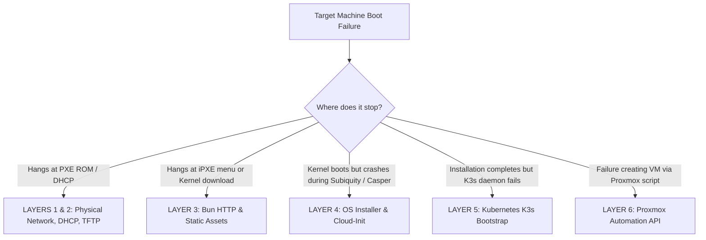

# Troubleshooting & Debugging Guide

This guide provides a layered diagnostic methodology (from physical networking and DHCP/TFTP to HTTP assets, the Subiquity installer, and the K3s Kubernetes cluster), accompanied by real-world error messages and console rescue commands.

---

## 1. Layered Diagnostic Tree



---

## 2. Layers 1 & 2: Local Network, DHCP & TFTP Handshake

### 2.1. `PXE-E11: ARP timeout` or Infinite `DHCP...` Loop
- **Symptom**: The console displays `DHCP... /` for 30–60 seconds, followed by `PXE-E11: ARP timeout` or `No bootable device found`.
- **Root Causes**:
  1. The target client does not receive `DHCPOFFER` from the router/DHCP server.
  2. The Proxmox VM is attached to the wrong network bridge (e.g., `vmbr1` instead of `vmbr0` where DHCP operates).
  3. Physical cable disconnection or incorrect switch port VLAN tag (Access VLAN mismatched with Bun server subnet).
- **Remediation**:
  - Verify Proxmox bridge connectivity:
    ```bash
    brctl show vmbr0
    ```
  - Capture DHCP discovery traffic on the router or Bun server:
    ```bash
    sudo tcpdump -i any -n "port 67 or port 68"
    ```

### 2.2. `PXE-E32: TFTP open timeout`
- **Symptom**: The client receives a DHCP IP lease, but halts during TFTP file transfer:
  ```
  PXE-T01: File not found
  PXE-E32: TFTP open timeout
  ```
- **Root Causes**:
  1. DHCP Option 66 (`Next-Server`) points to an unreachable IP or incorrect host.
  2. Firewall rules (UFW / iptables) on the TFTP server block UDP port 69.
  3. `ipxe.efi` is missing from the TFTP root directory (`/var/lib/tftpboot/`).
- **Validation Test from another host**:
  ```bash
  # Attempt pulling ipxe.efi over TFTP via CLI:
  tftp 192.168.250.202 -c get ipxe.efi
  ls -lh ipxe.efi
  ```

---

## 3. Layer 3: Bun HTTP Server & Static Assets

### 3.1. iPXE Reports `Connection timed out` or `HTTP 404 Not Found`
- **Symptom**: iPXE initializes but displays:
  ```
  http://192.168.250.202:3000/boot.ipxe?mac=... Connection timed out
  ```
- **Root Causes**:
  1. The Bun server daemon is not running (`bun run dev` or `docker compose up -d`).
  2. `BASE_URL` in `.env` is configured as `http://localhost:3000` rather than the accessible LAN IP (`http://192.168.250.202:3000`).
  3. Host firewall blocks TCP port 3000.
- **Remediation**:
  - Review `.env`:
    ```ini
    PORT=3000
    HOST=0.0.0.0
    BASE_URL=http://192.168.250.202:3000
    ```
  - Open host firewall:
    ```bash
    sudo ufw allow 3000/tcp
    ```

### 3.2. iPXE Halts During `vmlinuz` or `initrd` Download: `Asset not found`
- **Symptom**: Server responds with `Asset not found: ubuntu/24.04/vmlinuz`.
- **Root Cause**: Kernel or initrd binaries have not been downloaded into the `assets/` directory.
- **Remediation**:
  - Run the asset mirroring utility:
    ```bash
    bun run sync-assets ubuntu --download
    ```
  - Inspect downloaded assets:
    ```bash
    ls -lh assets/ubuntu/24.04/
    # Should contain: vmlinuz (~14MB - 60MB) and initrd (~70MB - 120MB)
    ```

### 3.3. Verifying HTTP Range Requests (Status 206)
Verify that Bun properly serves partial byte ranges for large ISO files:
```bash
curl -I -r 0-1024 http://192.168.250.202:3000/assets/ubuntu/24.04/vmlinuz
```
The response headers must contain **`HTTP/1.1 206 Partial Content`** and **`Accept-Ranges: bytes`**.

---

## 4. Layer 4: OS Installer (Subiquity / Cloud-Init)

### 4.1. OOM Killer: Subiquity Crashes on 4GB–5GB RAM VMs
- **Symptom**:
  - Ubuntu splash screen renders, progress bar advances, and the system abruptly drops to `root@casper-live:~#` or outputs:
    ```
    Out of memory: Killed process 1420 (subiquity) total-vm:2840512kB
    ```
- **Root Cause**:
  - Under `boot_method: http`, Casper downloads the complete **2.6GB** ISO directly into volatile memory (`tmpfs`).
  - Extracting `filesystem.squashfs` consumes an additional 1GB RAM.
  - The Python-based Subiquity installer requires ~800MB RAM.
  - Total memory demand exceeds 4.5GB, prompting the Linux Kernel Out-Of-Memory (OOM) Killer to terminate Subiquity!
- **Definitive Fix**:
  - Switch the VM configuration to **NFS Boot** (`boot_method: nfs`) in `config/hosts.yaml`:
    ```yaml
    custom:
      boot_method: nfs
      nfs_root: "192.168.250.4:/srv/nfs/ubuntu-24.04"
    ```
  - Under NFS boot, rootfs layers stream on-demand over the network (~300MB RAM consumption), allowing 4GB VMs to provision reliably.

---

### 4.2. Target Storage Device Not Found (`target_disk`)
- **Symptom**: Subiquity halts with storage partitioning errors.
- **Root Cause**:
  - `config/hosts.yaml` specifies `target_disk: "/dev/sda"`.
  - The VM uses a **VirtIO Block** controller (device named `/dev/vda`), or the bare-metal server uses an **NVMe SSD** (`/dev/nvme0n1`).
- **Remediation**:
  - Proxmox SCSI / SATA: `/dev/sda`.
  - Proxmox VirtIO Block: `/dev/vda`.
  - NVMe SSD: `/dev/nvme0n1`.
  - Or omit `target_disk` to allow Subiquity to select the primary drive using `layout: direct`.

---

### 4.3. Accessing the Emergency Shell & Live Installer Logs
When installation stalls or fails on the console:
1. In the Proxmox NoVNC console (or physical keyboard), press:
   ```
   Ctrl + Alt + F2   (or Alt + F2)
   ```
2. The display switches to an **Emergency Shell** logged in as root.
3. Inspect live logs:
   ```bash
   # 1. Subiquity detailed server logs
   tail -n 100 /var/log/installer/subiquity-server-debug.log

   # 2. Curtin storage and partitioning logs
   cat /var/log/installer/curtin-install.log

   # 3. Stream cloud-init logs in real time
   journalctl -u cloud-init -f
   ```
4. Press `Ctrl + Alt + F1` to return to the graphical installer screen.

---

### 4.4. Kernel Panic: `VFS: Unable to mount root fs on unknown-block(0,0)`
- **Symptom**:
  - Immediately following kernel load via PXE / netboot.xyz:
    ```
    No filesystem could mount root, tried:
    Kernel panic - not syncing: VFS: Unable to mount root fs on unknown-block(0,0)
    ```
- **Root Causes**:
  1. **Version Skew between `vmlinuz` and `/lib/modules/`**: `vmlinuz` downloaded from an upstream floating netboot mirror does not match the frozen rootfs modules.
  2. **Dirty iPXE RAM Buffer from netboot.xyz**: Missing `imgfree` command causes corrupt initrd decompression.
  3. **UEFI Command Line Conflict**: `initrd=initrd` parameter conflicts with the EFI LoadFile2 protocol.
  4. **Ramdisk Size Limit**: Missing `ramdisk_size=3500000` causes buffer overflow during decompression.
- **Remediation**:
  - **Extract Kernel and Initrd directly from the same official ISO**:
    ```bash
    bsdtar -xf assets/ubuntu/24.04/ubuntu-24.04-live-server-amd64.iso -C /tmp casper/vmlinuz casper/initrd
    mv /tmp/casper/vmlinuz assets/ubuntu/24.04/vmlinuz
    mv /tmp/casper/initrd assets/ubuntu/24.04/initrd
    rm -rf /tmp/casper
    ```
  - Ensure the iPXE script includes `imgfree` and `root=/dev/ram0 ramdisk_size=3500000`.
  - Refer to [Kernel/Rootfs Synchronization & netboot.xyz Guide](kernel-sync-and-netboot-guide.md).

---

### 4.5. openSUSE Leap Micro 6.2 Issues (Kiwi PXE Netboot & Combustion)

Unlike Ubuntu Subiquity, openSUSE Leap Micro utilizes **Kiwi OEM PXE Netboot** paired with **Combustion firstboot scripts**. The following issues are unique to this netboot engine:

#### 4.5.1. Black Screen / Hang After Loading `vmlinuz` and `initrd`
- **Symptom**: iPXE downloads both the kernel and initrd, but immediately hangs on a black screen upon executing `boot`.
- **Root Cause**: The file `assets/suse-micro/6.2/initrd` was mistakenly extracted from `openSUSE-Leap-Micro.x86_64-6.2.initrd` (an offline media installer for CD/USB). This offline initrd **lacks dracut network and kiwi PXE netboot modules**. When the kernel boots with `rd.kiwi.install.pxe rd.neednet=1`, dracut crashes before activating the console framebuffer.
- **Remediation**:
  - Ensure `initrd` is sourced from `pxeboot.openSUSE-Leap-Micro.x86_64-6.2.initrd` (size ~202.8MB / 212,671,947 bytes), which contains the complete PXE networking stack.

#### 4.5.2. `failed to fetch http://.../openSUSE...sha256` Followed by Immediate Reboot
- **Symptom**: The kernel boots into dracut kiwi netboot, but aborts with a failed SHA256 checksum download error and reboots.
- **Root Cause**: The Kiwi PXE installer strictly verifies the SHA256 digest of the compressed raw image before writing to disk. If the HTTP server returns 404 for `openSUSE-Leap-Micro.x86_64-6.2.sha256`, the install sequence terminates immediately.
- **Remediation**:
  - Extract and place `openSUSE-Leap-Micro.x86_64-6.2.sha256` in `assets/suse-micro/6.2/`.
  - A symlink `openSUSE-Leap-Micro.x86_64-6.2.xz.sha256` can also be provided for Kiwi variants that look for the full image extension.

#### 4.5.3. Missing `.kernel` or `.initrd` File (HTTP 404 / Broken Symlink)
- **Symptom**: Kiwi netboot aborts reporting that `openSUSE-Leap-Micro.x86_64-6.2.kernel` cannot be fetched.
- **Root Cause**: In the upstream appliance tarball, `openSUSE-Leap-Micro.x86_64-6.2.kernel` is a relative symlink pointing to `pxeboot.openSUSE-Leap-Micro.x86_64-6.2.kernel`. Renaming the target to `vmlinuz` breaks this symlink.
- **Remediation**:
  - Copy rather than rename the source file during extraction.
  - Verify that `http://<BUN_IP>/assets/suse-micro/6.2/openSUSE-Leap-Micro.x86_64-6.2.kernel` returns `HTTP 200 OK`.

---

## 5. Layer 5: Kubernetes K3s Bootstrap

### 5.1. K3s Service Fails to Start or Node Reports `NotReady`
- **Check Status**:
  ```bash
  ssh homelab@192.168.250.33 "sudo systemctl status k3s"
  ```
- **Common Causes**:
  1. **Swap Not Disabled**: Kubelet rejects nodes with active swap.
     - Verify: `free -h` (Swap should show `0B`).
     - Disable: `sudo swapoff -a && sudo sed -i '/ swap / s/^\(.*\)$/#\1/g' /etc/fstab`.
  2. **Missing Kernel Modules**: Flannel CNI requires `br_netfilter` and `overlay`.
     - Verify: `lsmod | grep br_netfilter`.
     - Load: `sudo modprobe overlay && sudo modprobe br_netfilter`.

### 5.2. `permission denied` on `kubectl` Execution
- **Symptom**: Running `kubectl get nodes` outputs:
  ```
  error: error loading config file "/etc/rancher/k3s/k3s.yaml": open /etc/rancher/k3s/k3s.yaml: permission denied
  ```
- **Root Cause**: The default K3s kubeconfig is owned by `root` with `0600` permissions.
- **Remediation**:
  - The project's `k3s-single-node` profile automatically configures `write-kubeconfig-mode: "0644"` and links `~homelab/.kube/config`.
  - Manual repair:
    ```bash
    sudo chmod 644 /etc/rancher/k3s/k3s.yaml
    ```

### 5.3. Remote Kubeconfig Retrieval API
Fetch an automatically rewritten, ready-to-use kubeconfig directly from the Bun server:
```bash
# Download kubeconfig with rewritten external server IP
curl -s http://<BUN_IP>:3000/api/kubeconfig/<hostname-or-mac> > kubeconfig-<hostname>

# Pipe directly into kubectl without writing to disk:
curl -s http://<BUN_IP>:3000/api/kubeconfig/<hostname-or-mac> | kubectl --kubeconfig=/dev/stdin get nodes -o wide
```

### 5.4. Kubeconfig Retrieval Error: `Permission denied (publickey,password)`
- **Symptom**: Clicking "Kubeconfig" on the dashboard or querying `/api/kubeconfig/<node>` returns `502 Bad Gateway`:
  ```json
  {
    "error": "Failed to fetch kubeconfig from <node> via SSH.",
    "details": "homelab@<node-ip>: Permission denied (publickey,password,keyboard-interactive).",
    "hint": "SSH authentication failed. Ensure the server's SSH public key is added to..."
  }
  ```
- **Root Cause**: The iPXE server tries to SSH into the node as the configured user (default `homelab`), but the node does not have the server's public key authorized in `~/.ssh/authorized_keys`, or the server lacks an SSH private key.
- **Remediation**:
  1. **Automated via deploy script**: Deploying with `proxmox/deploy-lxc.sh` automatically synchronizes your local workstation's SSH key (`~/.ssh/id_ed25519` or `~/.ssh/id_rsa`) into the LXC container (`/root/.ssh/`).
  2. **Profile Configuration**: Ensure the matching public key is specified under `default.ssh_authorized_keys` in `config/hosts.yaml` so newly provisioned nodes trust it during bootstrap.
  3. **Manual Node Authorization**:
     ```bash
     ssh <user>@<node-ip> "echo '<SSH_PUBLIC_KEY>' >> ~/.ssh/authorized_keys"
     ```

---

## 6. Layer 6: Proxmox Automation (`proxmox/create-vm.ts`)

### 6.1. `PVE API Error (401 Unauthorized)` or `403 Forbidden`
- **Root Cause**: Invalid Proxmox API Token credentials or missing ACL permissions.
- **Remediation**:
  1. In Proxmox VE Web UI -> **Datacenter** -> **Permissions** -> **API Tokens**.
  2. Verify that `root@pam!automation` is created with *Privilege Separation* unchecked (or granted `Administrator` / `PVEVMAdmin` role).
  3. Update `proxmox/credentials.env`.

### 6.2. `CERT_HAS_EXPIRED` or `SELF_SIGNED_CERT_IN_CHAIN`
- **Remediation**: Set insecure mode in `proxmox/credentials.env`:
  ```ini
  PVE_INSECURE=true
  ```

---

## 7. Diagnostic Matrix & Emergency Rescue Actions

| Symptom | Fault Layer | Immediate Action |
| :--- | :--- | :--- |
| Halts at `DHCP...` with timeout | L1/L2 Network | Check cables, bridge `vmbr0`, and switch port VLAN tags |
| `PXE-E32: TFTP open timeout` | L3/L4 TFTP | Verify Router Option 66 IP, confirm `ipxe.efi` presence |
| iPXE `Connection timed out` port 3000 | L7 HTTP | Verify `BASE_URL` in `.env` matches LAN IP |
| Subiquity crashes to black console shell | RAM/OOM | Switch to `boot_method: nfs` in `config/hosts.yaml` |
| Subiquity disk partitioning error | Storage | Match controller: SCSI (`sda`), VirtIO (`vda`), NVMe |
| Leap Micro hangs on black screen after initrd | Kiwi/Initrd | Serve `pxeboot.openSUSE-Leap-Micro.x86_64-6.2.initrd` instead of offline initrd |
| Kiwi halts with `failed to fetch ... sha256` | Kiwi Checksum | Supply `openSUSE-Leap-Micro.x86_64-6.2.sha256` in assets directory |
| Kiwi reports `Asset not found: ...kernel` | Symlink | Restore valid `openSUSE...kernel` symlink to `pxeboot...kernel` |
| Machine continuously reinstalls on reboot | Anti-Loop | Check `/api/installed` webhook, or run `POST /api/reset?mac=...` |
| `kubectl` reports permission denied | K3s | Run `sudo chmod 644 /etc/rancher/k3s/k3s.yaml` |
