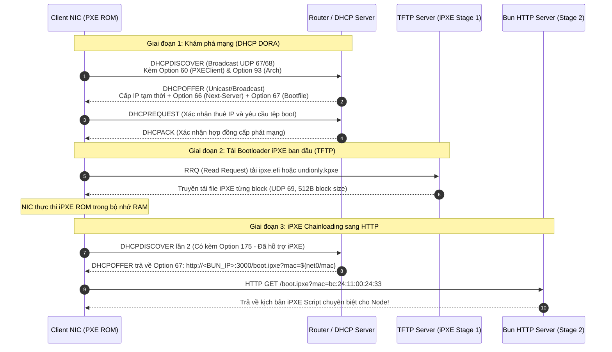

# Giao Thức Mạng & Thiết Lập Bộ Định Tuyến (Network Protocols & Router Setup)

Tài liệu này phân tích chi tiết các giao thức mạng tầng thấp chịu trách nhiệm khởi tạo quá trình khởi động máy qua mạng (**Network Boot / PXE**), giải thích cơ chế **Two-Stage Chainloading** với iPXE, và cung cấp hướng dẫn cấu hình sẵn sàng sử dụng cho các dòng Router / DHCP Server phổ biến trong Homelab và Data Center.

---

## 1. Vòng Đời Khởi Động PXE & Chu Kỳ DHCP DORA

Khi một máy tính (Bare-metal hoặc Virtual Machine) được bật nguồn với chế độ khởi động ưu tiên card mạng (**PXE / Network Boot First**), BIOS/UEFI ROM sẽ kích hoạt vi chương trình (firmware) của card mạng (NIC).

NIC chưa có hệ điều hành và chưa có địa chỉ IP. Nó sử dụng giao thức **DHCP (Dynamic Host Configuration Protocol)** qua cổng UDP 67 (Server) và UDP 68 (Client) theo chu kỳ **DORA**:



---

## 2. Giải Mã Chi Tiết Các DHCP Options Thiết Yếu

Một DHCP Server thông thường chỉ cấp IP, Subnet Mask, Gateway (Option 3) và DNS (Option 6). Để phục vụ Network Boot, các Option mở rộng sau bắt buộc phải được thiết lập:

| DHCP Option | Tên Tiêu Chuẩn | Ý Nghĩa Kỹ Thuật | Giá Trị Thực Tế Dự Án |
| :--- | :--- | :--- | :--- |
| **Option 66** | `Next-Server` / `tftp-server-name` | Địa chỉ IP của máy chủ lưu trữ tệp khởi động sơ cấp (TFTP Server). | `192.168.250.202` (hoặc IP của Router nếu tích hợp TFTP) |
| **Option 67** | `Bootfile-Name` | Đường dẫn tệp nhị phân bootloader mà ROM cần tải về thực thi. | `ipxe.efi` (UEFI) hoặc `undionly.kpxe` (BIOS) |
| **Option 60** | `Vendor-Class-Identifier` | Chuỗi định danh xác nhận client gửi request là card mạng PXE. | Chuỗi bắt đầu bằng `PXEClient:Arch:xxxxx` |
| **Option 93** | `Client-System-Architecture` | Mã định danh kiến trúc CPU & Firmware của máy client. | `0` (x86 BIOS), `7` (x64 UEFI), `9` (x64 UEFI HTTP), `11` (ARM64) |
| **Option 175** | `iPXE Encapsulated Options` | Trường dữ liệu đặc thù do iPXE gửi lên để báo hiệu client **đã là iPXE**. | Dùng để phân nhánh: tránh loop giữa TFTP và HTTP! |

---

## 3. Vấn Đề "Two-Stage Chainloading" & Tại Sao Cần iPXE?

### Hạn Chế Lớn Của PXE ROM Truyền Thống
1. **Giao thức TFTP (Trivial File Transfer Protocol) quá chậm**:
   - Chạy trên UDP cổng 69.
   - Cơ chế truyền theo kiểu Lock-Step (gửi 1 gói tin 512 bytes, phải chờ gói ACK từ client mới gửi tiếp gói tiếp theo).
   - Tải file ISO 2.6GB hoặc kernel 60MB qua TFTP có thể mất từ 30 phút đến hàng giờ, tỷ lệ mất gói rất cao.
2. **Không hỗ trợ HTTP/HTTPS**: Firmware card mạng đời cũ không hiểu giao thức Web, không thể tải file từ CDN, không hiểu Range Requests.
3. **Thiếu khả năng tương tác**: Không có giao diện menu đếm ngược linh hoạt, không truyền được MAC address lên Web Server theo Query Parameter.

### Giải Pháp Two-Stage Chainloading
Dự án sử dụng cơ chế **Chainloading 2 giai đoạn**:
- **Stage 1 (TFTP siêu nhẹ - < 1MB)**:
  - Máy client dùng ROM mặc định kéo file nhị phân của **iPXE** (`ipxe.efi` cho UEFI hoặc `undionly.kpxe` cho Legacy BIOS).
  - Vì file chỉ nặng khoảng vài trăm Kilobytes, quá trình tải qua TFTP chỉ mất chưa đầy 1 giây.
- **Stage 2 (HTTP siêu tốc - Bun Engine)**:
  - Sau khi iPXE nạp vào RAM, nó tái khởi động ngăn xếp mạng và gửi yêu cầu DHCP lần 2.
  - Lúc này iPXE gửi kèm **DHCP Option 175**. Router nhận thấy Option 175 sẽ chuyển hướng `Bootfile-Name` (Option 67) sang đường dẫn HTTP:
    ```
    http://192.168.250.202:3000/boot.ipxe?mac=${net0/mac}
    ```
  - Toàn bộ các file lớn (Kernel `vmlinuz` 60MB, `initrd` 120MB, ISO 2.6GB) từ đây sẽ được tải trực tiếp qua giao thức HTTP của máy chủ Bun với tốc độ Multi-Gigabit/s.

---

## 4. Hướng Dẫn Cấu Hình Trên Các Dòng Router Homelab

### 4.1. OPNsense / pfSense

Cả OPNsense và pfSense đều hỗ trợ tính năng **Network Booting** ngay trong cấu hình DHCP Server của từng interface.

#### Các bước thiết lập trên OPNsense:
1. Truy cập **Services** -> **DHCPv4** -> Chọn Interface mạng của bạn (ví dụ: `LAN` hoặc `VLAN_SERVERS`).
2. Cuộn xuống phần **Network Booting**:
   - Tích chọn **Enable Network Booting**.
   - **Next-Server**: Điền IP máy chủ lưu file iPXE/TFTP, ví dụ: `192.168.250.202`.
   - **Default BIOS file name**: Điền `undionly.kpxe`.
   - **UEFI 32 bit file name**: Điền `ipxe-i386.efi`.
   - **UEFI 64 bit file name**: Điền `ipxe.efi`.
   - **ARM 64 bit file name**: Điền `ipxe-arm64.efi`.
3. Nhấn **Save** và **Apply Changes**.

> [!TIP]
> Nếu bạn muốn chuyển thẳng sang URL của Bun iPXE khi client đã nạp xong iPXE, bạn có thể thiết lập dnsmasq hoặc sử dụng Kea DHCP / ISC DHCP Custom Options để kiểm tra cờ `exists user-class and option user-class = "iPXE"`.

---

### 4.2. MikroTik RouterOS

Trên MikroTik RouterOS, chúng ta sử dụng **DHCP Option Sets** kết hợp với **Matcher** để phân biệt giữa client PXE thường và client đã chạy iPXE.

#### Script thiết lập qua RouterOS Terminal:
```routeros
# 1. Tạo Option 66 (Next Server)
/ip dhcp-server option
add code=66 name=tftp_server value="'192.168.250.202'"

# 2. Tạo Option 67 cho Stage 1 (UEFI iPXE binary qua TFTP)
add code=67 name=bootfile_uefi value="'ipxe.efi'"

# 3. Tạo Option 67 cho Stage 2 (Bun HTTP Script)
add code=67 name=bootfile_http value="'http://192.168.250.202:3000/boot.ipxe'"

# 4. Gom thành Option Set
add name=set_pxe_stage1 options=tftp_server,bootfile_uefi
add name=set_pxe_stage2 options=bootfile_http

# 5. Gắn Option Set vào DHCP Server Network
/ip dhcp-server network
set [find address="192.168.250.0/24"] dhcp-option=set_pxe_stage1

# 6. Tạo Matcher tự động nhận diện iPXE (Option 175) để chuyển sang Stage 2
/ip dhcp-server matcher
add address-pool="" code=175 name=match_ipxe server=defconf dhcp-option=set_pxe_stage2
```

---

### 4.3. dnsmasq (Phổ biến trên Linux, Raspberry Pi, Pi-hole)

`dnsmasq` là công cụ lý tưởng nhất để cấu hình iPXE vì hỗ trợ tag matching cực kỳ mạnh mẽ và nhẹ.

Chỉnh sửa `/etc/dnsmasq.d/pxe.conf` (hoặc `/etc/dnsmasq.conf`):

```ini
# Lắng nghe trên interface mạng chỉ định
interface=eth0

# Bật tính năng TFTP tích hợp và chỉ định thư mục chứa file ipxe.efi
enable-tftp
tftp-root=/var/lib/tftpboot

# 1. Kiểm tra kiến trúc hệ thống (Option 93)
dhcp-match=set:bios,option:client-arch,0
dhcp-match=set:efi-x86,option:client-arch,6
dhcp-match=set:efi-x64,option:client-arch,7
dhcp-match=set:efi-x64,option:client-arch,9
dhcp-match=set:efi-arm64,option:client-arch,11

# 2. Kiểm tra nếu client đã là iPXE (Option 175)
dhcp-match=set:ipxe,175

# 3. Phân nhánh cấp phát Bootfile:
# Nếu là iPXE -> Trả về URL HTTP của Bun Server ngay lập tức
dhcp-boot=tag:ipxe,http://192.168.250.202:3000/boot.ipxe?mac=${net0/mac}

# Nếu chưa phải iPXE -> Trả về file nhị phân tương ứng qua TFTP
dhcp-boot=tag:bios,undionly.kpxe,,192.168.250.202
dhcp-boot=tag:efi-x64,ipxe.efi,,192.168.250.202
dhcp-boot=tag:efi-arm64,ipxe-arm64.efi,,192.168.250.202
```

Sau đó khởi động lại dịch vụ:
```bash
sudo systemctl restart dnsmasq
```

---

### 4.4. OpenWrt

Trên OpenWrt, dịch vụ DHCP mặc định được quản lý bởi `dnsmasq`. Bạn có thể chỉnh sửa tệp `/etc/config/dhcp`:

```uci
config boot 'linux'
    option filename 'ipxe.efi'
    option serverdir '/var/tftpboot'
    option serveraddress '192.168.250.202'

config match 'ipxe_stage2'
    option network 'lan'
    option match '175'
    option boot 'http://192.168.250.202:3000/boot.ipxe?mac=${net0/mac}'
```

Hoặc thêm trực tiếp các dòng `dhcp-match` và `dhcp-boot` vào `/etc/dnsmasq.conf` như mục 4.3.

---

### 4.5. Giải Pháp Đơn Giản: Sử Dụng netboot.xyz Làm Bước Đệm

Nếu bạn không muốn hoặc không có quyền cấu hình DHCP Option nâng cao trên Router gia đình:
1. Cài đặt **netboot.xyz** trên USB hoặc tải file ISO `netboot.xyz.iso` vào máy ảo Proxmox.
2. Khởi động máy vào menu giao diện của netboot.xyz.
3. Chọn mục **"Custom URLs"** hoặc gõ phím `c` vào chế độ dòng lệnh iPXE CLI.
4. Gõ lệnh nạp trực tiếp kịch bản của Bun server:
   ```ipxe
   chain --autofree http://192.168.250.202:3000/boot.ipxe?mac=${net0/mac}
   ```

---

## 5. Kỹ Thuật Bắt Gói & Debug Lưu Lượng Mạng

Khi máy client bật lên nhưng dừng ở màn hình đen hoặc báo lỗi `PXE-E11: ARP timeout` / `PXE-E32: TFTP open timeout`, bạn có thể bắt gói tin trên máy chủ để xem chính xác các gói tin trao đổi:

### Bắt gói tin DHCP & TFTP trên máy Linux:
```bash
# Lắng nghe toàn bộ lưu lượng cổng DHCP (67/68) và TFTP (69)
sudo tcpdump -i any -n -v "port 67 or port 68 or port 69"
```

### Kiểm tra gói tin trong Wireshark:
Bộ lọc Wireshark tiêu chuẩn để phân tích:
```wireshark
bootp || tftp || http
```

**Các điểm kiểm tra mấu chốt**:
1. Trong gói tin **DHCPOFFER** và **DHCPACK**:
   - `Next server IP address` phải khớp với IP máy chủ TFTP của bạn.
   - `Boot file name` phải trỏ đúng tên file (`ipxe.efi`).
2. Trong gói tin **TFTP**:
   - Client phải gửi yêu cầu `Read Request (RRQ)` cho file `ipxe.efi`.
   - TFTP Server phải phản hồi lại `Data Packet (Block 1)` thay vì thông báo lỗi `File not found (1)`.
3. Trong lưu lượng **HTTP**:
   - Ngay sau khi iPXE nạp xong, phải thấy gói `GET /boot.ipxe?mac=...` gửi tới cổng 3000 của máy chủ Bun.
