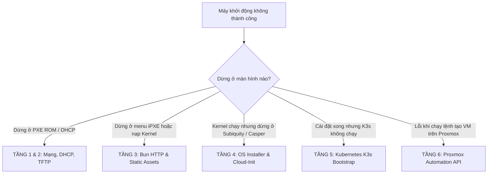

# Sổ Tay Chẩn Đoán & Xử Lý Sự Cố (Troubleshooting & Debugging Guide)

Tài liệu này cung cấp quy trình chẩn đoán lỗi phân tầng từ thấp đến cao (từ tầng vật lý/mạng, DHCP/TFTP, HTTP, đến bộ cài đặt OS Subiquity và cụm Kubernetes K3s), kèm theo các mẫu thông báo lỗi thực tế và bộ lệnh cứu hộ nhanh trên Console.

---

## 1. Sơ Đồ Phân Tầng Chẩn Đoán Lỗi (Layered Diagnostic Tree)



---

## 2. Tầng 1 & 2: Sự Cố Mạng Cục Bộ, DHCP & TFTP Handshake

### 2.1. Lỗi `PXE-E11: ARP timeout` hoặc `DHCP...` quay vòng vô tận
- **Triệu chứng**: Màn hình console của máy dừng ở dòng chữ `DHCP... /` trong khoảng 30–60 giây rồi báo lỗi `PXE-E11: ARP timeout` hoặc `No bootable device found`.
- **Nguyên nhân**:
  1. Máy client không nhận được phản hồi `DHCPOFFER` từ Router/DHCP Server.
  2. Máy ảo Proxmox đang gắn vào bridge mạng sai (ví dụ: gắn vào `vmbr1` thay vì `vmbr0` nơi có DHCP Server).
  3. Cáp mạng bị lỏng hoặc cổng Switch bị cấu hình sai VLAN (Port Access VLAN khác với Subnet của Bun Server).
- **Cách khắc phục**:
  - Kiểm tra xem máy ảo có thông mạng không:
    ```bash
    # Trên máy chủ Proxmox, kiểm tra bridge
    brctl show vmbr0
    ```
  - Bắt gói tin DHCP trên router hoặc máy chủ Bun để xem máy có gửi gói `DHCPDISCOVER` lên không:
    ```bash
    sudo tcpdump -i any -n "port 67 or port 68"
    ```

### 2.2. Lỗi `PXE-E32: TFTP open timeout`
- **Triệu chứng**: Máy đã nhận được địa chỉ IP từ DHCP, nhưng dừng ở bước kết nối TFTP và báo:
  ```
  PXE-T01: File not found
  PXE-E32: TFTP open timeout
  ```
- **Nguyên nhân**:
  1. DHCP Option 66 (`Next-Server`) trỏ vào IP không tồn tại hoặc sai IP của máy chủ TFTP.
  2. Firewall (UFW / iptables) trên máy chủ TFTP đang chặn cổng UDP 69.
  3. File `ipxe.efi` không nằm đúng trong thư mục root của TFTP server (`/var/lib/tftpboot/`).
- **Lệnh kiểm tra từ một máy tính khác trong mạng**:
  ```bash
  # Thử kéo file ipxe.efi qua giao thức TFTP bằng lệnh CLI:
  tftp 192.168.250.202 -c get ipxe.efi
  ls -lh ipxe.efi
  ```

---

## 3. Tầng 3: Sự Cố Bun HTTP Server & Static Asset Server

### 3.1. Lỗi iPXE báo `Connection timed out` hoặc `HTTP 404 Not Found`
- **Triệu chứng**: Giao diện iPXE xuất hiện nhưng báo:
  ```
  http://192.168.250.202:3000/boot.ipxe?mac=... Connection timed out
  ```
- **Nguyên nhân**:
  1. Máy chủ Bun chưa được khởi động (`bun run dev` hoặc `docker compose up -d`).
  2. Biến môi trường `BASE_URL` trong file `.env` bị cấu hình thành `http://localhost:3000` thay vì IP LAN thực tế (`http://192.168.250.202:3000`).
  3. Firewall máy chủ đang chặn cổng TCP 3000.
- **Cách khắc phục**:
  - Mở file `.env` và kiểm tra lại `BASE_URL`:
    ```ini
    PORT=3000
    HOST=0.0.0.0
    BASE_URL=http://192.168.250.202:3000
    ```
  - Mở cổng Firewall trên máy chủ Ubuntu chạy Bun:
    ```bash
    sudo ufw allow 3000/tcp
    ```

### 3.2. Lỗi iPXE dừng khi tải `vmlinuz` hoặc `initrd`: `Asset not found`
- **Triệu chứng**: Server trả về mã `Asset not found: ubuntu/24.04/vmlinuz`.
- **Nguyên nhân**: Bạn chưa tải các file kernel và initrd vào thư mục `assets/`.
- **Cách khắc phục**:
  - Chạy công cụ đồng bộ tài nguyên tích hợp:
    ```bash
    bun run sync-assets ubuntu --download
    ```
  - Kiểm tra xem file đã xuất hiện chưa:
    ```bash
    ls -lh assets/ubuntu/24.04/
    # Phải có: vmlinuz (khoảng 14MB - 60MB) và initrd (khoảng 70MB - 120MB)
    ```

### 3.3. Kiểm tra tính năng HTTP Range 206 (Hỗ trợ kéo file ISO lớn)
Để xác nhận máy chủ Bun xử lý đúng phân đoạn file theo chuẩn HTTP Range:
```bash
curl -I -r 0-1024 http://192.168.250.202:3000/assets/ubuntu/24.04/vmlinuz
```
Kết quả trả về phải chứa dòng **`HTTP/1.1 206 Partial Content`** và **`Accept-Ranges: bytes`**.

---

## 4. Tầng 4: Sự Cố OS Installer (Subiquity / Cloud-Init)

Đây là tầng thường gặp sự cố phức tạp nhất trong môi trường Homelab.

### 4.1. Lỗi OOM Killer: Subiquity bị crash đột ngột trên VM RAM 4GB–5GB
- **Triệu chứng**:
  - Màn hình console hiện logo Ubuntu, thanh tiến trình chạy được một đoạn rồi đột ngột thoát ra màn hình terminal `root@casper-live:~#` hoặc xuất hiện dòng chữ:
    ```
    Out of memory: Killed process 1420 (subiquity) total-vm:2840512kB
    ```
- **Bản chất nguyên nhân**:
  - Khi dùng `boot_method: http`, Casper tải toàn bộ file ISO dung lượng **2.6GB** nạp thẳng vào RAM (`tmpfs`).
  - Hệ điều hành giải nén `filesystem.squashfs` mất thêm 1GB RAM.
  - Bộ cài đặt Python của Subiquity yêu cầu thêm khoảng 800MB RAM.
  - Tổng nhu cầu vượt quá 4.5GB, kích hoạt Linux Kernel Out-Of-Memory (OOM) Killer tiêu diệt Subiquity!
- **Giải pháp dứt điểm**:
  - Chuyển cấu hình máy sang **NFS Boot** (`boot_method: nfs`) trong `config/hosts.yaml`:
    ```yaml
    custom:
      boot_method: nfs
      nfs_root: "192.168.250.4:/srv/nfs/ubuntu-24.04"
    ```
  - Khi dùng NFS, rootfs được stream trực tiếp qua mạng, RAM của VM hoàn toàn trống (chỉ tốn ~300MB), VM 4GB cài đặt mượt mà 100%!

---

### 4.2. Lỗi không tìm thấy ổ đĩa đích (`target_disk`)
- **Triệu chứng**: Subiquity dừng cài đặt và báo lỗi không thể tạo phân vùng bảng mã lưu trữ.
- **Nguyên nhân**:
  - Trong `config/hosts.yaml` khai báo `target_disk: "/dev/sda"`.
  - Nhưng trên máy ảo Proxmox, bạn chọn kiểu controller đĩa là **VirtIO Block** (tên thiết bị sẽ là `/dev/vda`), hoặc trên máy thật là ổ **NVMe SSD** (tên thiết bị là `/dev/nvme0n1`).
- **Cách khắc phục**:
  - Nếu dùng SCSI / SATA trên Proxmox: điền `/dev/sda`.
  - Nếu dùng VirtIO Block: điền `/dev/vda`.
  - Nếu dùng NVMe: điền `/dev/nvme0n1`.
  - Hoặc bỏ dòng `target_disk` để hệ thống tự động nhận diện ổ đĩa chính theo cơ chế `layout: direct`.

---

### 4.3. Cách Mở Emergency Shell & Đọc Log Trực Tiếp Trên Màn Hình Cài Đặt
Khi máy đang trong quá trình cài đặt mà bị dừng hoặc báo lỗi:
1. Trên cửa sổ Proxmox NoVNC Console (hoặc bàn phím máy thật), nhấn tổ hợp phím:
   ```
   Ctrl + Alt + F2   (hoặc Alt + F2)
   ```
2. Màn hình sẽ chuyển sang cửa sổ dòng lệnh **Emergency Shell** (đã đăng nhập sẵn user root).
3. Sử dụng các lệnh sau để đọc chính xác nguyên nhân lỗi:
   ```bash
   # 1. Đọc log chi tiết của Subiquity installer
   tail -n 100 /var/log/installer/subiquity-server-debug.log

   # 2. Đọc log phân vùng ổ cứng và curtin
   cat /var/log/installer/curtin-install.log

   # 3. Theo dõi log thời gian thực của cloud-init
   journalctl -u cloud-init -f
   ```
4. Nhấn `Ctrl + Alt + F1` để quay lại màn hình đồ họa/tiến trình cài đặt.

---

### 4.4. Lỗi Kernel Panic: `VFS: Unable to mount root fs on unknown-block(0,0)`
- **Triệu chứng**:
  - Khi khởi động qua mạng (PXE / netboot.xyz) trên Bare-metal hoặc VM, kernel vừa nạp xong thì sập màn hình đen báo lỗi:
    ```
    No filesystem could mount root, tried:
    Kernel panic - not syncing: VFS: Unable to mount root fs on unknown-block(0,0)
    ```
- **Nguyên nhân cốt lõi**:
  1. **Lệch phiên bản giữa Kernel (`vmlinuz`) và Rootfs (`/lib/modules/`)**: File `vmlinuz` tải từ online netboot mirror (ví dụ Kernel 7.0 HWE) nhưng Rootfs (NFS hoặc Squashfs trong ISO) chỉ có module của Kernel 6.8 GA.
  2. **Bộ nhớ đệm iPXE của netboot.xyz bị bẩn**: Thiếu lệnh `imgfree` khiến iPXE ghép nối ảnh cũ vào `initrd` làm hỏng quá trình giải nén ramdisk.
  3. **Xung đột tham số `initrd=initrd` trên UEFI**: Trình EFI Stub hiểu nhầm là phải tìm file `initrd` trên phân vùng ổ đĩa cục bộ thay vì nhận qua RAM từ iPXE.
  4. **Dung lượng ramdisk quá nhỏ**: Thiếu `ramdisk_size=3500000` khiến ramdisk bị tràn khi giải nén firmware và zstd rootfs.
- **Cách khắc phục**:
  - **Trích xuất trực tiếp Kernel và Initrd từ cùng file ISO gốc (Single Source of Truth)**:
    ```bash
    bsdtar -xf assets/ubuntu/24.04/ubuntu-24.04-live-server-amd64.iso -C /tmp casper/vmlinuz casper/initrd
    mv /tmp/casper/vmlinuz assets/ubuntu/24.04/vmlinuz
    mv /tmp/casper/initrd assets/ubuntu/24.04/initrd
    rm -rf /tmp/casper
    ```
  - Trong kịch bản iPXE, luôn thêm `imgfree` và tham số `root=/dev/ram0 ramdisk_size=3500000`.
  - **Xem tài liệu hướng dẫn chuyên sâu**: [Cẩm Nang Đồng Bộ Kernel/Rootfs & Tích Hợp netboot.xyz](file:///Users/timi/lab/lab-ipxe-os/docs/kernel-sync-and-netboot-guide.md).

---

## 5. Tầng 5: Sự Cố Kubernetes K3s & Bootstrap

Sau khi máy đã hoàn tất cài đặt và khởi động lại vào Ubuntu:

### 5.1. K3s service không khởi động hoặc node ở trạng thái `NotReady`
- **Kiểm tra**:
  ```bash
  ssh homelab@192.168.250.33 "sudo systemctl status k3s"
  ```
- **Nguyên nhân phổ biến**:
  1. **Swap chưa được tắt**: Kubelet từ chối khởi động nếu phân vùng swap còn bật.
     - Kiểm tra: `free -h` (Swap phải hiển thị `0B`).
     - Tắt nhanh nếu bị sót: `sudo swapoff -a && sudo sed -i '/ swap / s/^\(.*\)$/#\1/g' /etc/fstab`.
  2. **Thiếu Kernel Modules**: CNI Flannel yêu cầu `br_netfilter` và `overlay`.
     - Kiểm tra: `lsmod | grep br_netfilter`.
     - Nạp tức thì: `sudo modprobe overlay && sudo modprobe br_netfilter`.

### 5.2. Lỗi `permission denied` khi chạy lệnh `kubectl` với user `homelab`
- **Triệu chứng**: Gõ `kubectl get nodes` báo:
  ```
  error: error loading config file "/etc/rancher/k3s/k3s.yaml": open /etc/rancher/k3s/k3s.yaml: permission denied
  ```
- **Nguyên nhân**: File cấu hình kubeconfig mặc định của K3s chỉ cấp quyền đọc cho user `root` (mode 600).
- **Khắc phục**:
  - Profile `k3s-single-node` của dự án đã cài sẵn file `/etc/rancher/k3s/config.yaml` với `write-kubeconfig-mode: "0644"`, đồng thời tạo sẵn symlink `~homelab/.kube/config`.
  - Nếu cấu hình thủ công:
    ```bash
    sudo chmod 644 /etc/rancher/k3s/k3s.yaml
    ```

### 5.3. Cách lấy file kubeconfig an toàn từ xa qua API Server
Không cần SSH thủ công và copy/paste file cấu hình rồi sửa địa chỉ IP bằng tay, bạn có thể gọi thẳng endpoint API của Bun server:
```bash
# Tải về file kubeconfig (tự động đổi IP server về IP node)
curl -s http://<BUN_IP>:3000/api/kubeconfig/<hostname-hoặc-mac> > kubeconfig-<hostname>

# Thực thi lệnh kubectl trực tiếp không cần lưu file:
curl -s http://<BUN_IP>:3000/api/kubeconfig/<hostname-hoặc-mac> | kubectl --kubeconfig=/dev/stdin get nodes -o wide
```
- **Lưu ý mã lỗi HTTP**:
  - `400 Bad Request`: Thiếu định danh node hoặc node cấu hình profile không chạy cụm Kubernetes (ví dụ profile `generic`).
  - `404 Not Found`: Không tìm thấy node trong `config/hosts.yaml` lẫn `data/state.json`.
  - `502 Bad Gateway`: Node chưa hoàn thành cài đặt, SSH daemon chưa mở hoặc Kubernetes chưa kịp sinh file config.

---

## 6. Tầng 6: Sự Cố Tự Động Hóa Proxmox VE (`proxmox/create-vm.ts`)

### 6.1. Lỗi `PVE API Error (401 Unauthorized)` hoặc `403 Forbidden`
- **Nguyên nhân**: Proxmox API Token ID hoặc Secret không chính xác, hoặc Token chưa được gán quyền trên Proxmox Cluster.
- **Cách khắc phục**:
  1. Đăng nhập vào Proxmox VE Web UI -> **Datacenter** -> **Permissions** -> **API Tokens**.
  2. Đảm bảo token `root@pam!automation` được tạo và tích bỏ chọn cờ *Privilege Separation* (hoặc cấp quyền Role `Administrator` / `PVEVMAdmin` cho Token tại thẻ **Permissions**).
  3. Cập nhật đúng secret vào file `proxmox/credentials.env`.

### 6.2. Lỗi `CERT_HAS_EXPIRED` hoặc `SELF_SIGNED_CERT_IN_CHAIN`
- **Khắc phục**: Thêm dòng sau vào `proxmox/credentials.env`:
  ```ini
  PVE_INSECURE=true
  ```
  Script tự động bỏ qua kiểm tra chứng chỉ SSL tự ký của Proxmox VE.

---

## 7. Bảng Tra Cứu Nhanh Triệu Chứng & Hành Động Cứu Hộ

| Triệu Chứng Nhận Biết | Tầng Lỗi | Hành Động Xử Lý Ngay Lập Tức |
| :--- | :--- | :--- |
| Dừng ở `DHCP...` rồi timeout | L1/L2 Mạng | Kiểm tra cáp, bridge `vmbr0`, VLAN tag trên Switch |
| Báo `PXE-E32: TFTP open timeout` | L3/L4 TFTP | Kiểm tra IP Option 66 trên Router, kiểm tra file `ipxe.efi` |
| iPXE báo `Connection timed out` cổng 3000 | L7 HTTP | Kiểm tra `BASE_URL` trong file `.env` của Bun server |
| Subiquity crash văng ra shell màn hình đen | RAM/OOM | Đổi sang `boot_method: nfs` trong `config/hosts.yaml` |
| Subiquity báo lỗi ổ đĩa target storage | Ổ Cứng | Kiểm tra xem VM dùng SCSI (`sda`), VirtIO (`vda`) hay NVMe |
| Máy cứ reboot xong lại cài lại từ đầu | Anti-Loop | Kiểm tra xem node có gọi được `/api/installed` không, hoặc chạy lệnh reset: `POST /api/reset?mac=...` |
| Lệnh `kubectl` báo permission denied | K3s | Chạy `sudo chmod 644 /etc/rancher/k3s/k3s.yaml` |
