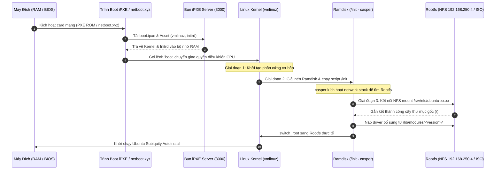
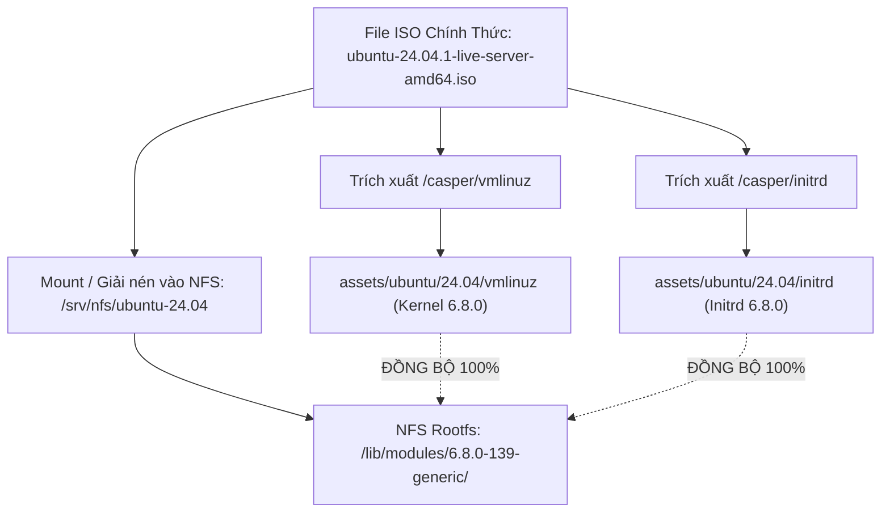

# Cẩm Nang Đồng Bộ Kernel/Rootfs & Tích Hợp netboot.xyz (Kernel Lifecycle Guide)

Tài liệu này cung cấp phân tích kiến trúc chuyên sâu về mối quan hệ giữa **Linux Kernel (`vmlinuz`)**, **Initial RAM Disk (`initrd`)**, và **Hệ thống tập tin gốc (Rootfs)** trong môi trường Network Boot (PXE / iPXE / netboot.xyz). Tài liệu giải thích bản chất lỗi **Kernel Panic `VFS: Unable to mount root fs on unknown-block(0,0)`**, nghịch lý lệch phiên bản giữa "Floating Netboot Mirror" và "Fixed ISO", cùng quy trình chuẩn hóa **Một nguồn chân lý (Single Source of Truth)** khi nâng cấp hệ điều hành trong tương lai (Ubuntu 26.04 / Kernel 7.x).

---

## 1. Bản Chất Kiến Trúc Khởi Động Linux Qua Mạng (3-Stage Network Boot)

Khác với việc khởi động từ ổ cứng vật lý (nơi bootloader chỉ cần đọc phân vùng EFI trên đĩa), quá trình khởi động Linux qua mạng gồm 3 giai đoạn độc lập:



### Quy tắc vàng bất biến của Linux Kernel:
> **Phiên bản Kernel của file `vmlinuz` BẮT BUỘC phải KHỚP 100% với tên thư mục driver `/lib/modules/<kernel-version>/` nằm trên Rootfs (trên NFS Server hoặc file `squashfs` của ISO).**

* `vmlinuz` là Kernel nhân tối giản, không thể nhúng toàn bộ driver của hàng nghìn loại card mạng và ổ đĩa vào một file 15MB.
* Các driver phần cứng (như Realtek r8169, Intel e1000e, igc 2.5GbE, NFS client, OverlayFS) được biên dịch thành các module độc lập (`.ko`) và lưu trữ tại `/lib/modules/$(uname -r)/`.
* Nếu `vmlinuz` là phiên bản **7.0.0**, nhưng thư mục trên Rootfs lại chỉ có `/lib/modules/6.8.0-139-generic/`, Kernel 7.0 sẽ **không thể nạp bất kỳ driver nào** $\rightarrow$ Hệ điều hành sụp đổ ngay trước khi kịp nhận diện ổ đĩa hay card mạng.

---

## 2. Giải Mã Sự Cố: `Kernel panic - not syncing: VFS: Unable to mount root fs on unknown-block(0,0)`

Đây là lỗi kinh điển nhưng nguy hiểm nhất trong môi trường Bare-metal Network Boot. Khi màn hình console dừng lại ở dòng chữ này:

```
[    1.482910] List of all partitions:
[    1.483102] No filesystem could mount root, tried: 
[    1.483250] Kernel panic - not syncing: VFS: Unable to mount root fs on unknown-block(0,0)
[    1.483420] CPU: 2 PID: 1 Comm: swapper/0 Not tainted 6.8.0-139-generic #139-Ubuntu
[    1.483590] Hardware name: Default string Default string/B760M, BIOS 1.00 05/10/2024
[    1.483750] Call Trace:
[    1.483850]  <TASK>
[    1.483950]  dump_stack_lvl+0x48/0x70
[    1.484100]  panic+0x340/0x380
[    1.484250]  mount_block_root+0x1a8/0x240
[    1.484400]  mount_root+0x38/0x50
[    1.484550]  prepare_namespace+0x138/0x180
[    1.484700]  kernel_init+0x18/0x140
[    1.484850]  </TASK>
```

### 2.1. Bản chất hàm thực thi trong Kernel Linux
Trong mã nguồn Linux kernel (`init/main.c` và `init/do_mounts.c`):
1. Hàm `kernel_init()` sau khi nạp xong CPU/RAM sẽ cố gắng giải nén `initrd` thành bộ nhớ `ramfs` tạm thời.
2. Nó kiểm tra xem file thực thi `/init` có tồn tại trong `ramfs` hay không (`try_to_run_init_process("/init")`).
3. **Nếu `/init` không chạy được** (do không nhận được initrd, initrd giải nén hỏng, hoặc bộ nhớ ramdisk bị đầy), kernel lập tức rơi xuống nhánh cứu hộ cuối cùng: thử mount phân vùng ổ đĩa root từ tham số `root=`.
4. Do trong kịch bản Netboot ta không khai báo phân vùng ổ cứng cục bộ nào (hoặc biến `ROOT_DEV` mặc định là `0:0`), kernel kết luận không tìm thấy thiết bị lưu trữ và kích hoạt lệnh `panic("VFS: Unable to mount root fs on %s", "unknown-block(0,0)")`!

### 2.2. Ba nguyên nhân kỹ thuật gốc rễ tạo nên lỗi này

| # | Nguyên Nhân Kỹ Thuật | Cơ Chế Gây Lỗi | Giải Pháp Triệt Để |
| :- | :--- | :--- | :--- |
| **1** | **Xung đột tham số `initrd=initrd` trên UEFI Boot Stub** | Trên bo mạch chủ UEFI máy thật, Kernel 6.x/7.x sử dụng giao thức chuẩn **`EFI_LOAD_FILE2_PROTOCOL`** để nhận initrd từ iPXE. Khi ta truyền thêm chuỗi `initrd=initrd` vào dòng lệnh kernel, EFI Stub hiểu nhầm là phải tìm một file vật lý tên `initrd` trên phân vùng ESP ổ cứng. Không thấy file, nó **bỏ qua hoàn toàn initrd trong RAM**! | Bỏ `initrd=initrd` trên dòng `kernel`, để iPXE tự đăng ký qua `LoadFile2`. |
| **2** | **Bộ nhớ đệm iPXE bị chồng lấn do netboot.xyz (Thiếu `imgfree`)** | netboot.xyz nạp sẵn font, menu, chứng chỉ SSL vào RAM của iPXE. Khi chainload sang kịch bản của Bun server mà không chạy `imgfree`, iPXE ghép nối file cũ với file `initrd` mới tạo ra tệp nén bị lỗi (`Initramfs unpacking failed: junk in compressed archive`). | Đặt lệnh **`imgfree`** ở đầu kịch bản cài đặt để dọn sạch RAM iPXE. |
| **3** | **Dung lượng Ramdisk bị giới hạn (`ramdisk_size` quá nhỏ)** | Initrd của Ubuntu 24.04 (Noble) chứa firmware card mạng uncompressed (~50MB) và rootfs zstd nén. Khi giải nén, nó cần hơn 2GB không gian đệm. Mức `ramdisk_size=1500000` (1.5GB) bị tràn bộ nhớ trong quá trình decompress. | Nâng tham số lên **`ramdisk_size=3500000`** (3.5GB) theo chuẩn của netboot.xyz. |

---

## 3. Nghịch Lý Lệch Pha: "Floating Netboot Mirror" vs "Fixed ISO Release"

Tại sao trước đó file `vmlinuz` trên máy chủ Bun và thư mục NFS `/srv/nfs/ubuntu-24.04` lại bị lệch nhau?

```
┌─────────────────────────────────────────────────────────────────────────────┐
│  Link Trực Tuyến: releases.ubuntu.com/24.04/netboot/amd64/linux             │
│  => Canonical cập nhật ngày 09/09/2026: NÂNG LÊN KERNEL 7.0.0-31 (HWE)      │
└─────────────────────────────────────────────────────────────────────────────┘
                                  VS
┌─────────────────────────────────────────────────────────────────────────────┐
│  File ISO Cố Định: ubuntu-24.04.1-live-server-amd64.iso                     │
│  => Cố định SHA256 checksum: DÙNG GA KERNEL 6.8.0-139 (Generic)             │
│  => Thư mục /lib/modules/ trong Rootfs CHỈ CÓ driver bản 6.8.0-139          │
└─────────────────────────────────────────────────────────────────────────────┘
                                  ||
                                  ▼
                   ❌ LỆCH PHA PHIÊN BẢN (KERNEL MISMATCH) ❌
        Kernel 7.0 boot vào nhưng không tìm thấy module driver 7.0 trên NFS!
```

* **File ISO là tài nguyên "Đóng Băng" (Frozen Release)**: Để bảo toàn mã băm SHA256 phục vụ xác thực bảo mật, Canonical không bao giờ thay đổi nội dung của một file ISO sau khi đã phát hành. Toàn bộ Squashfs và thư mục `/lib/modules/` trong ISO 24.04.1 là Kernel 6.8.0-139.
* **Thư mục Netboot Web là "Thư Mục Động" (Floating Mirror)**: Canonical liên tục cập nhật thư mục này theo tiến độ phát triển của các bản vá phần cứng HWE (Hardware Enablement).
* **Bài học kiến trúc**: Tuyệt đối **KHÔNG BAO GIỜ** tải Kernel từ một URL trên mạng và tải Rootfs/ISO từ một URL khác. Chúng phải luôn xuất phát từ cùng một thực thể duy nhất.

---

## 4. Kiến Trúc "Một Nguồn Chân Lý" (Single Source of Truth từ ISO)

Để loại bỏ 100% nguy cơ lệch phiên bản ở bất kỳ bản phân phối nào (Ubuntu 24.04, 26.04 hay Debian/RHEL), dự án chuẩn hóa mô hình **Single Source of Truth**:



### Lệnh trích xuất chuẩn hóa bằng `bsdtar`:
```bash
# Trích xuất cặp đôi Kernel & Initrd trực tiếp từ ruột file ISO
bsdtar -xf assets/ubuntu/24.04/ubuntu-24.04-live-server-amd64.iso -C /tmp casper/vmlinuz casper/initrd
mv /tmp/casper/vmlinuz assets/ubuntu/24.04/vmlinuz
mv /tmp/casper/initrd assets/ubuntu/24.04/initrd
rm -rf /tmp/casper
```

> [!TIP]
> Bên trong ISO Ubuntu luôn có 2 cặp nhân:
> 1. **GA Kernel (Generic)**: `/casper/vmlinuz` + `/casper/initrd` (Mặc định được khuyến nghị cho tính ổn định tối đa).
> 2. **HWE Kernel (Hardware Enablement)**: `/casper/hwe-vmlinuz` + `/casper/hwe-initrd` (Dành cho bo mạch chủ và CPU quá mới).

---

## 5. Cấu Hình Kịch Bản iPXE Chuẩn (Tương Thích netboot.xyz & Bare-metal)

Định nghĩa trong file [src/providers/ubuntu/ipxe.ts](file:///Users/timi/lab/lab-ipxe-os/src/providers/ubuntu/ipxe.ts):

```ipxe
#!ipxe
# ==========================================================
# Homelab Ubuntu 24.04 ZTP Provisioning Script
# ==========================================================

# 1. Giải phóng toàn bộ ảnh bộ nhớ cũ của netboot.xyz
imgfree

set base_url http://192.168.250.202:3000

echo [*] Loading Linux Kernel (Single Source of Truth)...
# 2. Tham số kernel chuẩn hóa cho UEFI & Casper
# - root=/dev/ram0: Khai báo thiết bị lưu trữ tạm
# - ramdisk_size=3500000: Cung cấp 3.5GB đệm giải nén initramfs
# - cloud-config-url=/dev/null: Ngăn Subiquity treo tìm metadata
# - ds=nocloud-net: Điểm nạp Autoinstall user-data
kernel ${base_url}/assets/ubuntu/24.04/vmlinuz root=/dev/ram0 ramdisk_size=3500000 boot=casper netboot=nfs nfsroot=192.168.250.4:/srv/nfs/ubuntu-24.04 ip=dhcp autoinstall ds=nocloud-net;s=${base_url}/os/ubuntu/${mac}/ cloud-config-url=/dev/null

echo [*] Loading Initrd Image...
initrd ${base_url}/assets/ubuntu/24.04/initrd

echo [*] Booting target machine...
boot
```

### Kịch bản cứu hộ / Force Reinstall từ client (`force.ipxe`):
Khi người quản trị muốn ép máy cài đặt lại từ đầu qua netboot.xyz:

```ipxe
#!ipxe
set base_url http://192.168.250.202:3000

echo =========================================================
echo [*] Homelab ZTP: TRIGGERING FORCE REINSTALL
echo [*] Server: ${base_url}
echo =========================================================

isset ${ip} || dhcp
set target_mac ${net0/mac}
isset ${target_mac} || set target_mac ${mac}

echo [*] Target MAC: ${target_mac}
sleep 1

# Dọn sạch RAM netboot.xyz và chuyển tiếp sang server Bun
imgfree
chain --autofree ${base_url}/boot.ipxe?mac=${target_mac}&force=true&auto=1 || goto fail

:fail
echo [!] ERROR: Cannot connect to server ${base_url}!
shell
```

---

## 6. Hướng Dẫn Tương Lai: Nâng Cấp Lên Ubuntu 26.04 (Kernel 7.x)

Khi bạn muốn bổ sung phiên bản **Ubuntu 26.04** với Kernel 7 mới vào hệ thống mà không làm ảnh hưởng tới các node 24.04 hiện tại:

### Bước 1: Tải ISO Ubuntu 26.04 về server
```bash
mkdir -p assets/ubuntu/26.04
# Tải file ISO chính thức đặt vào:
# assets/ubuntu/26.04/ubuntu-26.04-live-server-amd64.iso
```

### Bước 2: Chuẩn bị Rootfs trên NFS Server (`192.168.250.4`)
Trên máy chủ NFS, giải nén hoặc mount file ISO 26.04:
```bash
sudo mkdir -p /srv/nfs/ubuntu-26.04
sudo mount -o loop /path/to/ubuntu-26.04-live-server-amd64.iso /mnt
sudo cp -a /mnt/* /srv/nfs/ubuntu-26.04/
sudo umount /mnt
# Thư mục /srv/nfs/ubuntu-26.04/lib/modules/ giờ đây đã chứa driver Kernel 7.x
```

### Bước 3: Trích xuất Kernel 7 & Initrd từ chính ISO 26.04
```bash
bsdtar -xf assets/ubuntu/26.04/ubuntu-26.04-live-server-amd64.iso -C /tmp casper/vmlinuz casper/initrd
mv /tmp/casper/vmlinuz assets/ubuntu/26.04/vmlinuz
mv /tmp/casper/initrd assets/ubuntu/26.04/initrd
rm -rf /tmp/casper
```

### Bước 4: Khai báo Node trong [config/hosts.yaml](file:///Users/timi/lab/lab-ipxe-os/config/hosts.yaml)
Chỉ cần cập nhật trường `version: "26.04"` cho node mong muốn:

```yaml
hosts:
  "e8:9c:25:7b:af:d8":
    hostname: "k3s-single-node-i5"
    os: ubuntu
    version: "26.04"                  # <--- Cập nhật phiên bản
    profile: k3s-single-node
    custom:
      boot_method: nfs
      nfs_root: "192.168.250.4:/srv/nfs/ubuntu-${version}"  # Tự động trỏ sang 26.04
    storage:
      target_disk: "/dev/sda"
    force_install: true
```

* Máy chủ Bun sẽ tự động phục vụ:
  - Kernel: `http://192.168.250.202:3000/assets/ubuntu/26.04/vmlinuz` (Kernel 7)
  - Initrd: `http://192.168.250.202:3000/assets/ubuntu/26.04/initrd`
  - NFS Root: `192.168.250.4:/srv/nfs/ubuntu-26.04` (Khớp 100% driver Kernel 7)

---

## 7. Bảng Kiểm Tra Nhanh 5 Bước (Quick Reference Checklist)

Khi gặp bất kỳ sự cố máy tính dừng ở màn hình Kernel Panic hoặc không tải được hệ điều hành:

- [ ] **1. Kiểm tra tính đồng bộ Kernel & Modules**: File `vmlinuz` và thư mục `/lib/modules/` trên NFS/ISO có cùng một phiên bản không (`file vmlinuz` vs `ls /srv/nfs/.../lib/modules`)?
- [ ] **2. Kiểm tra lệnh `imgfree`**: Script iPXE có chạy `imgfree` trước khi tải kernel hay không (đặc biệt khi boot qua netboot.xyz)?
- [ ] **3. Kiểm tra tham số `ramdisk_size`**: Có đủ lớn (`ramdisk_size=3500000`) để giải nén toàn bộ initramfs không?
- [ ] **4. Kiểm tra dòng lệnh Kernel trong UEFI**: Đã loại bỏ chuỗi `initrd=initrd` để tránh xung đột với EFI Stub chưa?
- [ ] **5. Kiểm tra quyền truy cập NFS / HTTP**: Từ một máy tính khác trong mạng, thử `curl -I http://192.168.250.202:3000/assets/ubuntu/24.04/vmlinuz` và kiểm tra showmount NFS `showmount -e 192.168.250.4`.

---

## 8. Assets Proxmox VE 9.2: Sinh Bằng Assistant (Không Bóc ISO Thủ Công)

Khác với Ubuntu/SUSE, kernel và initrd của Proxmox VE **không bóc trực tiếp từ ISO gốc** mà phải sinh bằng công cụ chính chủ `proxmox-auto-install-assistant` (cặp file này đã nhúng sẵn cấu hình trỏ về `/os/proxmox/answer` của server):

```bash
apt install proxmox-auto-install-assistant xorriso

proxmox-auto-install-assistant prepare-iso proxmox-ve_9.2-1.iso \
  --fetch-from http --url "http://192.168.250.202:3000/os/proxmox/answer" \
  --pxe --pxe-loader ipxe --output ./proxmox-pxe/

# ISO payload cho initrd thứ hai (xem os-engines.md §4 vì sao không dùng ISO của --pxe)
proxmox-auto-install-assistant prepare-iso proxmox-ve_9.2-1.iso \
  --fetch-from http --url "http://192.168.250.202:3000/os/proxmox/answer" \
  --output proxmox-ve-9.2-auto.iso

mkdir -p assets/proxmox/9.2
cp ./proxmox-pxe/vmlinuz ./proxmox-pxe/initrd.img assets/proxmox/9.2/
cp proxmox-ve-9.2-auto.iso assets/proxmox/9.2/
```

Kiểm tra nhanh:

```bash
curl -I http://192.168.250.202:3000/assets/proxmox/9.2/vmlinuz
curl -I http://192.168.250.202:3000/assets/proxmox/9.2/initrd.img
curl -I http://192.168.250.202:3000/assets/proxmox/9.2/proxmox-ve-9.2-auto.iso
# Render thử answer cho 1 node (không cần installer thật):
curl "http://192.168.250.202:3000/os/proxmox/answer?mac=bc:24:11:00:24:40"
```

> [!NOTE]
> Vì cặp `vmlinuz`/`initrd.img` đã gắn chặt với URL answer lúc chạy `prepare-iso`, nếu đổi `baseUrl` của server thì phải chạy lại lệnh trên và chép đè assets.
