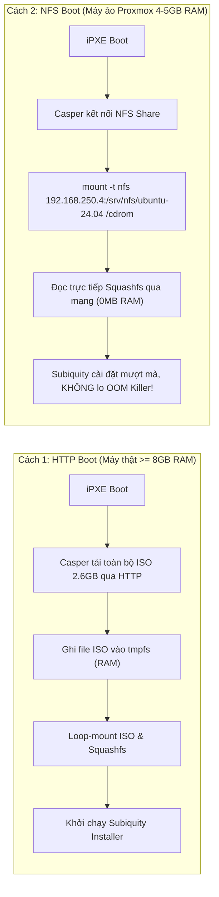
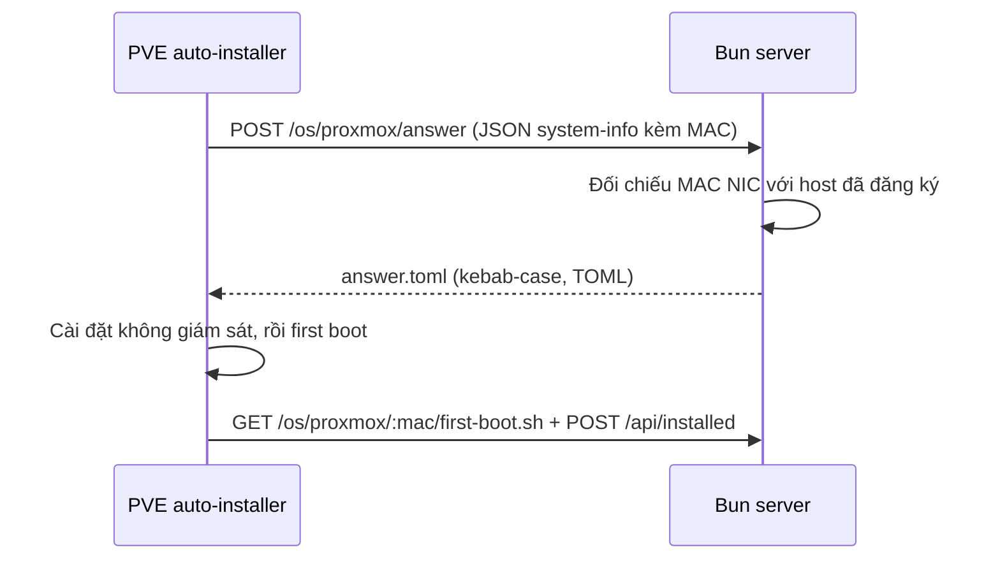
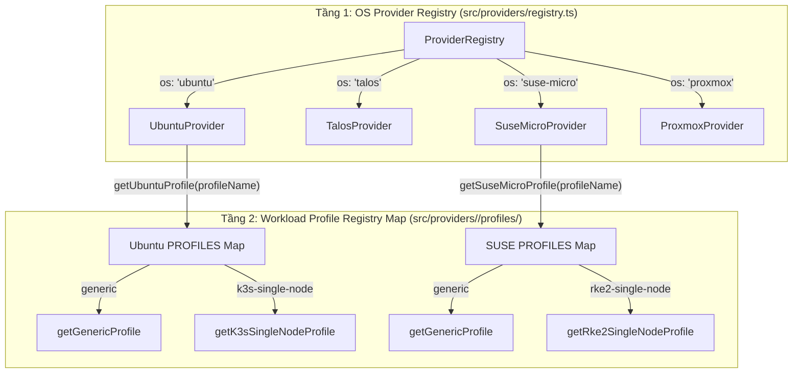

# Động Cơ Cài Đặt Hệ Điều Hành (OS Provisioning Engines)

Tài liệu này giải thích chi tiết cơ chế hoạt động bên trong của các động cơ cài đặt hệ điều hành tự động (**Automated OS Engines**) được tích hợp trong dự án: **Ubuntu Server 24.04 (Subiquity / Cloud-Init)**, **Talos Linux (MachineConfig)**, **openSUSE Leap Micro (Combustion)**, và **Proxmox VE 9.2 (Automated Installation)**. Đồng thời, tài liệu cung cấp hướng dẫn mở rộng để lập trình viên tự thêm các bản phân phối Linux mới vào hệ thống.

---

## 1. Ubuntu Server 24.04 LTS: Casper & Subiquity Autoinstall

Ubuntu Server từ phiên bản 20.04 LTS trở đi đã loại bỏ hoàn toàn bộ cài đặt cũ Debian-Installer (Preseed) và chuyển sang bộ cài đặt mới mang tên **Subiquity** kết hợp với **Casper live boot environment** và **Cloud-Init**.

### 1.1. Luồng Khởi Động Casper & Kernel Arguments

Khi iPXE nạp Linux Kernel (`vmlinuz`) và Ramdisk (`initrd`), nó truyền vào dòng lệnh Kernel Command Line (định nghĩa tại [src/providers/ubuntu/ipxe.ts](file:///Users/timi/lab/lab-ipxe-os/src/providers/ubuntu/ipxe.ts)):

```ipxe
kernel ${base_url}/assets/ubuntu/24.04/vmlinuz initrd=initrd \
  boot=casper \
  ip=dhcp \
  autoinstall \
  ds=nocloud-net;s=${base_url}/os/ubuntu/${mac}/ \
  [rootfs-loading-args]
```

**Giải mã các tham số cốt lõi**:
- `boot=casper`: Báo hiệu cho initrd biết hệ thống đang khởi động môi trường Live ISO của Ubuntu. Casper chịu trách nhiệm tìm kiếm và gắn kết (mount) hệ thống tệp nén `rootfs` (`filesystem.squashfs`).
- `autoinstall`: Kích hoạt cơ chế cài đặt tự động không chạm của Subiquity, ngăn chặn hiển thị màn hình cài đặt tương tác (bàn phím, ngôn ngữ, timezone).
- `ds=nocloud-net;s=...`: Chỉ thị cho Cloud-Init nạp dữ liệu từ DataSource `nocloud-net` tại URL máy chủ Bun.
  - Subiquity sẽ tự động truy vấn 2 endpoint HTTP:
    1. `${base_url}/os/ubuntu/${mac}/meta-data`: Chứa `instance-id` và `local-hostname`.
    2. `${base_url}/os/ubuntu/${mac}/user-data`: Chứa toàn bộ cấu hình cài đặt YAML `#cloud-config`.

---

### 1.2. So Sánh Hai Phương Thức Nạp Rootfs: HTTP Boot vs. NFS Boot

Đây là một trong những quyết định kiến trúc quan trọng nhất trong việc tối ưu tài nguyên Homelab:



| Tiêu Chí | HTTP Boot (`boot_method: http`) | NFS Boot (`boot_method: nfs`) |
| :--- | :--- | :--- |
| **Tham số Boot** | `url=${base_url}/assets/.../ubuntu-24.04-live-server.iso` | `netboot=nfs nfsroot=192.168.250.4:/srv/nfs/ubuntu-24.04` |
| **Cơ chế nạp** | Tải toàn bộ file ISO dung lượng 2.6GB lưu vào bộ nhớ RAM (`tmpfs`). | Gắn kết thư mục ISO đã trích xuất từ xa qua giao thức NFS v3/v4. |
| **Yêu cầu RAM tối thiểu** | **≥ 8GB RAM**. Nếu RAM 4GB–5GB, Subiquity sẽ bị Linux Kernel OOM Killer tiêu diệt giữa chừng. | **4GB RAM** (Thậm chí 3GB RAM vẫn cài đặt thành công). |
| **Hạ tầng phụ trợ** | **Không cần** (Bun HTTP Server tự phục vụ toàn bộ). | Cần 1 máy chủ NFS nội bộ (Synology NAS, TrueNAS hoặc Linux NFS). |
| **Phù hợp nhất cho** | Máy chủ vật lý Bare-Metal RAM dồi dào. | Máy ảo Proxmox VE, cụm Cluster ảo hóa tài nguyên hạn chế. |

---

### 1.3. Cơ Chế HTTP Range Requests (Mã 206) Cho File Lớn

Để nạp file ISO kích thước nhiều Gigabytes một cách tin cậy, máy chủ tĩnh Bun [src/core/static-server.ts](file:///Users/timi/lab/lab-ipxe-os/src/core/static-server.ts) được lập trình để xử lý chuẩn HTTP Header `Range: bytes=start-end`:

```typescript
// Trích đoạn từ src/core/static-server.ts
const rangeHeader = req.headers.get("range");
if (rangeHeader && rangeHeader.startsWith("bytes=")) {
  const parts = rangeHeader.replace(/bytes=/, "").split("-");
  const start = parseInt(parts[0], 10);
  const end = parts[1] ? parseInt(parts[1], 10) : stat.size - 1;
  const chunkLength = end - start + 1;
  const slicedFile = file.slice(start, end + 1);

  return new Response(slicedFile, {
    status: 206,
    headers: {
      "Content-Range": `bytes ${start}-${end}/${stat.size}`,
      "Accept-Ranges": "bytes",
      "Content-Length": chunkLength.toString(),
      "Content-Type": file.type || "application/octet-stream",
    },
  });
}
```

Nhờ hỗ trợ mã phản hồi **206 Partial Content**, Linux Casper có thể đọc trực tiếp các sector và header ISO mà không bắt buộc phải tải toàn bộ file cùng một lúc, đồng thời cho phép tiếp tục tải (resume) khi đường truyền mạng có sự cố chập chờn.

---

### 1.4. Phân Tích Cấu Trúc Subiquity `#cloud-config` (`user-data`)

File cấu hình do Bun server sinh động tại [src/providers/ubuntu/autoinstall.ts](file:///Users/timi/lab/lab-ipxe-os/src/providers/ubuntu/autoinstall.ts) bao gồm các khối chức năng quan trọng:

1. **Định danh & Truy cập (`identity` & `ssh`)**:
   - Khởi tạo user mặc định (`homelab`) với password hash SHA-512.
   - Bơm SSH Public Keys được cấu hình trong `config/hosts.yaml` vào file `~/.ssh/authorized_keys`.
2. **Lưu trữ (`storage`)**:
   - Chế độ `layout.name: direct` tự động sử dụng toàn bộ dung lượng ổ đĩa không thông qua LVM phức tạp.
   - Cho phép chỉ định chính xác tên thiết bị đích bằng `layout.match.path` (`/dev/sda`, `/dev/vda`, hoặc `/dev/nvme0n1`).
3. **Mạng (`network`)**:
   - Sinh cấu hình Netplan phiên bản 2 chuẩn.
   - Hỗ trợ cả DHCP động lẫn IP tĩnh (Static IP, Subnet CIDR, Gateway, DNS Nameservers).
4. **Bộ lệnh hậu kỳ (`late-commands`)**:
   - Đây là nơi hệ thống thực thi các tinh chỉnh sâu vào hệ điều hành vừa cài đặt trước khi máy khởi động lại.
   - Lệnh được thực thi bằng tiện ích `curtin in-target --target=/target -- <command>` (chroot trực tiếp vào ổ đĩa vừa ghi của máy đích).

---

### 1.5. Mổ Xẻ Chuyên Sâu Profile `k3s-single-node`

Profile `k3s-single-node` được module hóa độc lập tại [src/providers/ubuntu/profiles/k3s-single-node.ts](file:///Users/timi/lab/lab-ipxe-os/src/providers/ubuntu/profiles/k3s-single-node.ts), biến một máy Ubuntu trắng thành một cụm Kubernetes Single Node Production-ready:

```typescript
lateCommands: [
  // 1. Tắt vĩnh viễn phân vùng Swap trong /etc/fstab (bắt buộc cho Kubernetes Kubelet)
  `curtin in-target --target=/target -- sed -i '/ swap / s/^\\(.*\\)$/#\\1/g' /etc/fstab || true`,

  // 2. Tinh chỉnh Sysctl cho mạng ảo Kubernetes (Bridge Netfilter & IP Forward)
  `curtin in-target --target=/target -- sh -c 'cat <<EOF > /etc/sysctl.d/99-kubernetes.conf
net.bridge.bridge-nf-call-iptables  = 1
net.bridge.bridge-nf-call-ip6tables = 1
net.ipv4.ip_forward                 = 1
EOF'`,

  // 3. Tự động nạp các Kernel Modules cốt lõi khi khởi động
  `curtin in-target --target=/target -- sh -c 'cat <<EOF > /etc/modules-load.d/k8s.conf
overlay
br_netfilter
EOF'`,

  // 4. Tạo thư mục và cấu hình khai báo K3s chuẩn (/etc/rancher/k3s/config.yaml) với dynamic TLS SAN
  `curtin in-target --target=/target -- mkdir -p /etc/rancher/k3s`,
  `curtin in-target --target=/target -- sh -c 'cat <<EOF > /etc/rancher/k3s/config.yaml
write-kubeconfig-mode: "0644"
tls-san:
${sanEntries}
EOF'`,

  // 5. Dynamic fallback: bổ sung IP thực tế vào tls-san nếu máy nhận IP qua DHCP
  `curtin in-target --target=/target -- sh -c 'NODE_IP=$(ip -4 route get 1.1.1.1 2>/dev/null | awk "{print \\$7}"); if [ -n "$NODE_IP" ] && ! grep -q "$NODE_IP" /etc/rancher/k3s/config.yaml; then echo "  - \\"$NODE_IP\\"" >> /etc/rancher/k3s/config.yaml; fi'`,

  // 6. Cài đặt K3s binary & systemd service (hỗ trợ ghim phiên bản qua host.custom.k3s_version)
  `curtin in-target --target=/target -- sh -c 'curl -sfL https://get.k3s.io | ${k3sVersionEnv}INSTALL_K3S_SKIP_START=true sh -'`,

  // 7. Kích hoạt systemd unit k3s để tự chạy ngay khi máy boot lần đầu
  `curtin in-target --target=/target -- systemctl enable k3s || true`,

  // 8. Cấu hình biến môi trường KUBECONFIG toàn hệ thống và symlink ~/.kube/config cho user
  `curtin in-target --target=/target -- sh -c 'echo "KUBECONFIG=/etc/rancher/k3s/k3s.yaml" >> /etc/environment'`,
  `curtin in-target --target=/target -- sh -c 'echo "export KUBECONFIG=/etc/rancher/k3s/k3s.yaml" > /etc/profile.d/k3s.sh'`,
  `curtin in-target --target=/target -- mkdir -p /home/${defaultUser}/.kube /root/.kube`,
  `curtin in-target --target=/target -- ln -sf /etc/rancher/k3s/k3s.yaml /home/${defaultUser}/.kube/config`,
  `curtin in-target --target=/target -- ln -sf /etc/rancher/k3s/k3s.yaml /root/.kube/config`,
  `curtin in-target --target=/target -- chown -R ${defaultUser}:${defaultUser} /home/${defaultUser}/.kube || true`,

  // 9. Kích hoạt QEMU Guest Agent để Proxmox VE theo dõi IP và tình trạng máy ảo
  `curtin in-target --target=/target -- systemctl enable qemu-guest-agent || true`,

  // 10. Gửi Webhook Phone-Home về Bun Server để xác nhận hoàn tất & khóa Boot Loop!
  `curtin in-target --target=/target -- curl -s -X POST "${baseUrl}/api/installed?mac=..." || true`,
]
```

> [!IMPORTANT]
> Lưu ý kỹ thuật: Tham số `INSTALL_K3S_SKIP_START=true` là bắt buộc vì tại thời điểm `late-commands` thực thi, hệ điều hành đích vẫn đang nằm trong môi trường chroot (`/target`), systemd PID 1 thực sự của máy chưa chạy, nếu cố khởi động service K3s tại đây sẽ dẫn đến lỗi cài đặt Subiquity bị fail! Do đó lệnh `systemctl enable k3s` được gọi để kích hoạt service cho lần boot đầu tiên.
>
> Ngoài ra, các lệnh cơ sở hạ tầng dùng chung (như kích hoạt `qemu-guest-agent`, đồng bộ `efibootmgr`, và gọi Webhook `/api/installed`) được gom tập trung vào [`src/providers/ubuntu/profiles/base.ts`](file:///Users/timi/lab/lab-ipxe-os/src/providers/ubuntu/profiles/base.ts) và tự động nối vào cuối danh sách `lateCommands` ở tầng Dispatcher.

---

## 2. Talos Linux: Immutable Kubernetes Operating System

Khác biệt với Ubuntu, **Talos Linux** là một hệ điều hành bất biến (Immutable), không có shell, không có SSH, không có trình quản lý gói (apt/yum). Mọi thao tác cấu hình đều thông qua tệp khai báo YAML **MachineConfig**.

### 2.1. Tham Số Boot Talos Kernel
Định nghĩa tại [src/providers/talos/ipxe.ts](file:///Users/timi/lab/lab-ipxe-os/src/providers/talos/ipxe.ts):
```ipxe
kernel ${base_url}/assets/talos/v1.14.0/vmlinuz-amd64 \
  talos.platform=metal \
  talos.config=${base_url}/os/talos/${mac}/config.yaml \
  init_on_alloc=1 slab_nomerge pti=on \
  console=tty0 console=ttyS0 printk.devkmsg=on ip=dhcp
initrd ${base_url}/assets/talos/v1.14.0/initramfs-amd64.xz
boot
```

### 2.2. Sinh Động Talos MachineConfig
Tại [src/providers/talos/config.ts](file:///Users/timi/lab/lab-ipxe-os/src/providers/talos/config.ts), hệ thống tạo tài liệu cấu hình theo chuẩn Talos v1alpha1:
- Định cấu hình hostname theo khai báo trong `hosts.yaml`.
- Thiết lập phân vai trò node: `type: controlplane` hoặc `type: join` (worker node).
- Tự động nạp danh sách SSH keys hoặc token chứng thực của cluster.

---

## 3. openSUSE Leap Micro: Combustion Engine

openSUSE Leap Micro sử dụng công cụ cấu hình ban đầu mang tên **Combustion** (thực thi trước khi hệ thống systemd khởi động):
- Bun server cung cấp kịch bản Shell tại endpoint: `GET /os/suse-micro/:mac/combustion/script`.
- Kịch bản Combustion tự động:
  - Thiết lập mật khẩu root và hostname.
  - Ghi SSH public keys vào `/root/.ssh/authorized_keys`.
  - Thiết lập network tĩnh hoặc DHCP (qua NetworkManager connection).
  - Tự động mở rộng Btrfs root filesystem (`btrfs filesystem resize max /`).
  - Phục hồi thứ tự khởi động UEFI (`efibootmgr`) và gửi Webhook Phone-Home `/api/installed`.

Hệ thống hỗ trợ 2 profile cho openSUSE Leap Micro qua thư mục [`src/providers/suse-micro/profiles/`](file:///Users/timi/lab/lab-ipxe-os/src/providers/suse-micro/profiles/):
- **`generic`** ([generic.ts](file:///Users/timi/lab/lab-ipxe-os/src/providers/suse-micro/profiles/generic.ts)): Cài các gói cơ bản (`curl`, `git`, `qemu-guest-agent`) và mở rộng Btrfs root filesystem.
- **`rke2-single-node`** ([rke2-single-node.ts](file:///Users/timi/lab/lab-ipxe-os/src/providers/suse-micro/profiles/rke2-single-node.ts)): Tự động cài đặt **Rancher RKE2** bằng RPM method chính thức, cấu hình SELinux permissive, tắt swap & firewalld, bật sysctl/modules Kubernetes (vm.max_map_count = 262144), tắt auto-reboot ban đêm (`rebootmgr strategy=off`), cấu hình crictl socket, cấu hình CNI (Canal / Cilium), Ingress (Traefik / NGINX), và tạo symlink kubeconfig.

> [!TIP]
> Hướng dẫn chi tiết về vận hành, cập nhật hệ điều hành định kỳ (`transactional-update`), quản lý snapshot Btrfs (`snapper`), rollback sự cố và chính sách reboot xem tại: [docs/suse-micro-update-guide.md](file:///Users/timi/lab/lab-ipxe-os/docs/suse-micro-update-guide.md).

---

## 4. Proxmox VE 9.2: Cài Đặt Tự Động qua PXE + HTTP Answer

Proxmox VE từ 8.2 trở đi tích hợp **bộ cài tự động** điều khiển bằng file TOML gọi là **answer file**. Khác với Ubuntu/Talos/SUSE, cặp boot assets (`vmlinuz` + `initrd.img`) không thể bóc trực tiếp từ ISO gốc — phải sinh một lần bằng công cụ chính chủ, sau đó mỗi installer sẽ tải answer riêng của từng máy từ server qua HTTP.

### 4.1. Chuẩn Bị PXE Assets Một Lần (Máy Admin)

```bash
# 1. Cài công cụ assistant (máy admin Debian/PVE)
apt install proxmox-auto-install-assistant xorriso

# 2. Tách image đã chuẩn bị thành file boot PXE, gắn sẵn URL của server
proxmox-auto-install-assistant prepare-iso proxmox-ve_9.2-1.iso \
  --fetch-from http --url "http://192.168.250.202:3000/os/proxmox/answer" \
  --pxe --pxe-loader ipxe --output ./proxmox-pxe/

# 3. Chép kết quả vào asset mirror (Single Source of Truth)
mkdir -p assets/proxmox/9.2
cp ./proxmox-pxe/vmlinuz ./proxmox-pxe/initrd.img assets/proxmox/9.2/
```

### 4.2. Tham Số Boot iPXE

Định nghĩa tại [src/providers/proxmox/ipxe.ts](file:///Users/timi/lab/lab-ipxe-os/src/providers/proxmox/ipxe.ts):

```ipxe
kernel ${base_url}/assets/proxmox/9.2/vmlinuz initrd=initrd.img ramdisk_size=16777216 rw quiet splash=silent proxmox-start-auto-installer
initrd ${base_url}/assets/proxmox/9.2/initrd.img
boot
```

`proxmox-start-auto-installer` là bắt buộc — thiếu nó ISO sẽ boot vào trình cài tương tác. Lưu ý `initrd=initrd.img` ở đây là tên initrd đã đăng ký với iPXE (init script của Proxmox yêu cầu, khác trường hợp UEFI của Ubuntu).

### 4.3. Luồng Answer Động (`POST /os/proxmox/answer`)



Điểm chính của cài đặt ([src/providers/proxmox/answer.ts](file:///Users/timi/lab/lab-ipxe-os/src/providers/proxmox/answer.ts), route tại [src/routes/os-configs.ts](file:///Users/timi/lab/lab-ipxe-os/src/routes/os-configs.ts)):

- **Một URL chung, nội dung theo từng máy**: `--url` nhúng trong file PXE giống nhau cho mọi node. Server đọc body POST của installer (`mac_addresses[]` / `network_interfaces[].mac`) và render answer của host khớp; phần cứng lạ dùng profile `default:` chung (`homelab-xxxxxx`).
- **Chỉ dùng kebab-case**: PVE 9.x từ chối key `snake_case` cũ, nên generator sinh `root-password-hashed`, `disk-list`, `from-dhcp`, `zfs.raid`, ...
- **Các section**: `[global]` (fqdn, keyboard/country/timezone/mailto, `root-password-hashed` từ `password_hash`, `root-ssh-keys`), `[network]` (`from-dhcp` hoặc `from-answer` với CIDR/gateway/dns từ `hosts.yaml`), `[disk-setup]` (`filesystem` mặc định `ext4`, đĩa từ `storage.target_disk`, `zfs.raid`), `[first-boot]` (`source = "from-url"` trỏ tới hook theo MAC, hook này curl `/api/installed` để chuyển node sang `INSTALLED` và thoát vòng lặp cài lại).
- **Debug**: `GET /os/proxmox/answer?mac=<MAC>` render đúng answer đó mà không cần installer POST; kiểm tra answer bằng `proxmox-auto-install-assistant validate-answer answer.toml`.

File cấu hình mẫu: [config/examples/hosts.proxmox.yaml](file:///Users/timi/lab/lab-ipxe-os/config/examples/hosts.proxmox.yaml).

---

## 5. Mô Hình Kiến Trúc 2 Tầng Registry: Provider Registry & Profile Registry Map

Hệ thống được thiết kế theo nguyên lý **Separation of Concerns** và **Open-Closed Principle (OCP)** thông qua mô hình Registry 2 tầng:



### 5.1. Tại sao sử dụng Registry Map thay vì Switch-Case?

| Tiêu Chí | Switch-Case Trước Đây | Registry Map Hiện Tại |
| :--- | :--- | :--- |
| **Nguyên lý Open-Closed (OCP)** | Vi phạm: Mỗi lần thêm profile đều phải can thiệp trực tiếp vào thân hàm dispatcher. | Tuân thủ triệt để: Hàm dispatcher là pure function, chỉ cần thêm 1 dòng đăng ký vào Map. |
| **Boilerplate Code** | Nhiều khối lệnh `case "..." : return ...; break;` lặp đi lặp lại. | Khai báo dạng dữ liệu thuần túy (Declarative Data): `Record<string, ProfileHandler>`. |
| **Khả năng Nội suy (Introspection)** | Không thể liệt kê danh sách profile nếu không hardcode. | Dễ dàng lấy `Object.keys(PROFILES)` phục vụ API listing hoặc validate cấu hình `hosts.yaml`. |
| **Độ tin cậy & Fallback** | Dễ sót nhánh default hoặc xử lý hoa/thường không đồng nhất. | Luôn chuẩn hóa `.toLowerCase()` và fallback có cảnh báo `console.warn` về profile `generic`. |
| **Độ nhất quán (Consistency)** | Mỗi OS một kiểu viết (Ubuntu kiểu khác, SUSE kiểu khác). | Toàn bộ các Provider đều đồng bộ theo cùng 1 chuẩn cấu trúc module. |

### 5.2. Cấu Trúc Module Chuẩn Của Một Thư Mục Profile

`src/providers/ubuntu/profiles/`, `src/providers/suse-micro/profiles/` và `src/providers/proxmox/profiles/` đều tuân theo cấu trúc 4 thành phần:

```
src/providers/<os>/profiles/
├── types.ts              # Interface ProfileSpec và Type ProfileHandler
├── base.ts               # (Tùy chọn) Các late-commands/snippets nền tảng dùng chung
├── generic.ts            # Profile cơ sở mặc định (Standard base utilities)
├── <custom-profile>.ts   # Profile chuyên biệt (k3s-single-node, rke2-single-node, ...)
└── index.ts              # Pure Dispatcher sử dụng Registry Map
```

#### Ví dụ mã nguồn triển khai Registry Map (`src/providers/suse-micro/profiles/index.ts`):
```typescript
import type { HostConfig } from "../../../types.ts";
import type { SuseProfileSpec, SuseProfileHandler } from "./types.ts";
import { getGenericProfile } from "./generic.ts";
import { getRke2SingleNodeProfile } from "./rke2-single-node.ts";

export * from "./types.ts";

// Registry Map khai báo tập trung các profile
const PROFILES: Record<string, SuseProfileHandler> = {
  generic: getGenericProfile,
  "rke2-single-node": getRke2SingleNodeProfile,
};

// Pure Dispatcher Function
export function getSuseMicroProfile(
  profileName: string,
  host: HostConfig,
  baseUrl: string
): SuseProfileSpec {
  const normalizedKey = profileName.toLowerCase();
  let handler = PROFILES[normalizedKey];

  if (!handler) {
    console.warn(
      `[openSUSE Leap Micro Profile] Unknown profile "${profileName}", falling back to "generic".`
    );
    handler = getGenericProfile;
  }

  return handler(host, baseUrl);
}
```

### 5.3. Quy trình 3 bước thêm một Profile mới

Khi bạn muốn thêm một profile mới (ví dụ: `k3s-worker` cho Ubuntu hoặc `microos-desktop` cho SUSE):

1. **Tạo file profile độc lập:** Tạo `src/providers/<os>/profiles/<tên-profile>.ts` và xuất hàm `get...Profile(host: HostConfig, baseUrl: string): ProfileSpec`.
2. **Đăng ký vào Registry Map:** Mở `src/providers/<os>/profiles/index.ts`, import hàm vừa tạo và thêm 1 dòng vào đối tượng `PROFILES`:
   ```typescript
   const PROFILES: Record<string, ProfileHandler> = {
     generic: getGenericProfile,
     "k3s-single-node": getK3sSingleNodeProfile,
     "k3s-worker": getK3sWorkerProfile, // <-- Thêm tại đây
   };
   ```
3. **Sử dụng trong `config/hosts.yaml`:** Khai báo `profile: k3s-worker` cho máy đích. Hệ thống sẽ tự động điều hướng mà không cần sửa bất kỳ dòng code routing nào khác!

---

## 6. Hướng Dẫn Mở Rộng: Tự Thêm OS Provider Mới


Kiến trúc của dự án được thiết kế theo mẫu **Strategy / Registry Pattern**, cho phép bạn dễ dàng tích hợp thêm các bản phân phối Linux khác (ví dụ: Debian, Alpine Linux, Fedora CoreOS, Arch Linux).

### Quy trình 3 bước tích hợp OS mới:

#### Bước 1: Tạo thư mục Provider và kế thừa `BaseProvider`
Tạo thư mục mới `src/providers/debian/index.ts`:

```typescript
import { BaseProvider } from "../base.ts";
import type { BootContext, HostConfig } from "../../types.ts";

export class DebianProvider extends BaseProvider {
  public readonly id = "debian";
  public readonly name = "Debian GNU/Linux";
  public readonly defaultVersion = "12";

  // 1. Sinh kịch bản iPXE nạp Kernel & Preseed
  public renderIpxe(ctx: BootContext): string {
    const { hostConfig, baseUrl, mac } = ctx;
    const version = hostConfig.version || this.defaultVersion;

    return `#!ipxe
echo Starting Debian ${version} Netboot...
kernel ${baseUrl}/assets/debian/${version}/linux initrd=initrd.gz auto=true priority=critical preseed/url=${baseUrl}/os/debian/${mac}/preseed.cfg
initrd ${baseUrl}/assets/debian/${version}/initrd.gz
boot
`;
  }

  // 2. Xử lý các endpoint trả về cấu hình tự động (vd: preseed.cfg)
  public async handleConfigRoute(
    subpath: string,
    req: Request,
    ctx: { hostConfig: HostConfig; baseUrl: string }
  ): Promise<Response> {
    if (subpath === "preseed.cfg") {
      const preseedContent = `
d-i debian-installer/locale string en_US
d-i netcfg/get_hostname string ${ctx.hostConfig.hostname}
d-i preseed/late_command string in-target curl -X POST "${ctx.baseUrl}/api/installed?mac=${ctx.hostConfig.mac}"
`;
      return new Response(preseedContent, {
        headers: { "Content-Type": "text/plain" },
      });
    }

    return new Response("Not Found", { status: 404 });
  }
}
```

#### Bước 2: Đăng ký vào Provider Registry
Mở [src/providers/registry.ts](file:///Users/timi/lab/lab-ipxe-os/src/providers/registry.ts) và đăng ký class mới:

```typescript
import { DebianProvider } from "./debian/index.ts";

export class ProviderRegistry {
  constructor() {
    this.register(new UbuntuProvider());
    this.register(new TalosProvider());
    this.register(new SuseMicroProvider());
    this.register(new DebianProvider()); // <-- Đăng ký thêm tại đây
  }
}
```

#### Bước 3: Khai báo host trong `config/hosts.yaml`
```yaml
hosts:
  "00:11:22:33:44:55":
    hostname: "debian-node-01"
    os: debian
    version: "12"
    profile: generic
```
Khởi động lại server hoặc lưu file, hệ thống sẽ lập tức nhận diện và phục vụ OS mới!
